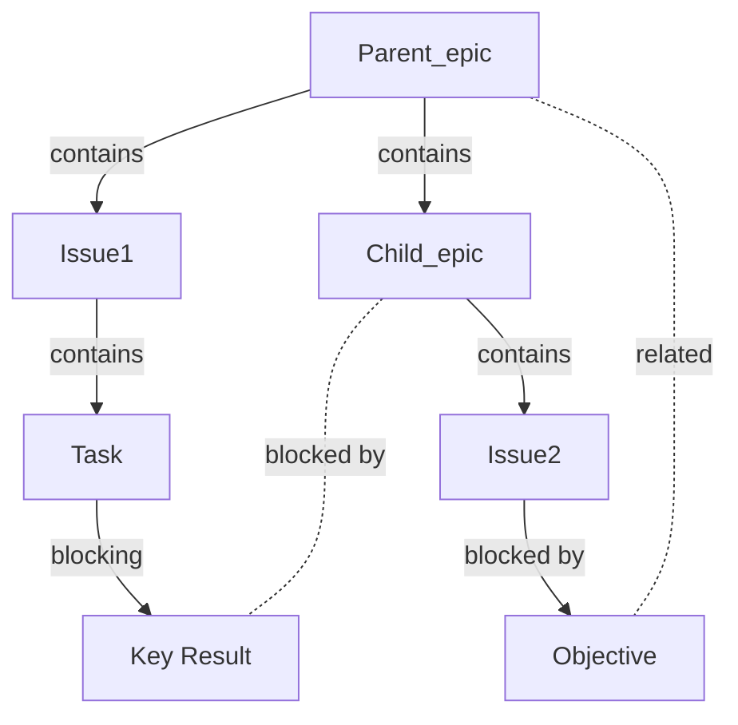

## apps/user-manuals/gitlab/user/project/labels.md

---
stage: Plan
group: Project Management
info: To determine the technical writer assigned to the Stage/Group associated with this page, see https://handbook.gitlab.com/handbook/product/ux/technical-writing/#assignments
title: Labels
description: Project labels, group labels, nested scopes, and filtering.
---



- Tier: Free, Premium, Ultimate
- Offering: GitLab.com, GitLab Self-Managed, GitLab Dedicated



Labels organize and track work across GitLab features.
As projects grow from small teams to large organizations, labels help you track and manage increasing volumes of work.
Labels:

- Categorize issues, merge requests, and epics with custom attributes.
- Filter content in lists and boards.
- Prioritize work items with colors and descriptive titles.
- Track priority and severity with scoped labels.
- Structure workflows through organized groupings.

## Types of labels

Use three types of labels in GitLab:

- **Project labels** can be assigned to issues and merge requests in that project only.
- **Group labels** can be assigned to issues, merge requests, and [epics](../group/epics/_index.md)
 in any project in the selected group or its subgroups.
- **Instance labels** [are created](../../administration/labels.md) by instance administrators and are copied to all new projects.

## Assign and unassign labels



- Real-time updates in the sidebar [introduced](https://gitlab.com/gitlab-org/gitlab/-/issues/241538) in GitLab 14.10 with a [feature flag](../../administration/feature_flags/_index.md) named `realtime_labels`, disabled by default.
- Real-time updates in the sidebar [enabled on GitLab.com](https://gitlab.com/gitlab-org/gitlab/-/issues/357370#note_991987201) in GitLab 15.1.
- Real-time updates in the sidebar [enabled by default](https://gitlab.com/gitlab-org/gitlab/-/issues/357370) in GitLab 15.5.
- Real-time updates in the sidebar [generally available](https://gitlab.com/gitlab-org/gitlab/-/merge_requests/103199) in GitLab 15.6. Feature flag `realtime_labels` removed.



You can assign labels to any issue, merge request, or epic.

Changed labels are immediately visible to other users, without refreshing the page, on the following:

- Epics
- Incidents
- Issues
- Merge requests

To assign or unassign a label:

1. In the **Labels** section of the sidebar, select **Edit**.
1. In the **Assign labels** list, search for labels by typing their names.
   You can search repeatedly to add more labels.
   The selected labels are marked with a checkmark.
1. Select the labels you want to assign or unassign.
1. To apply your changes to labels, select **X** next to **Assign labels** or select any area outside the label section.

Alternatively, to unassign a label, select the **X** on the label you want to unassign.

You can also assign and unassign labels with quick actions:

- Assign labels with [`/label`](quick_actions.md#label).
- Remove labels with [`/unlabel`](quick_actions.md#unlabel).
- Remove all labels and assign new ones with [`/relabel`](quick_actions.md#relabel).

## View available labels

### View project labels

To view the **project's labels**:

1. On the top bar, select **Search or go to** and find your project.
1. Select **Manage** > **Labels**.

Or:

1. View an issue or merge request.
1. On the right sidebar, in the **Labels** section, select **Edit**.
1. Select **Manage project labels**.

The list of labels includes both the labels created in the project and all labels created in the project's ancestor groups. For each label, you can see the project or group path where it was created.

### View group labels

To view the **group's labels**:

1. On the top bar, select **Search or go to** and find your group.
1. Select **Manage** > **Labels**.

Or:

1. View an epic.
1. On the right sidebar, in the **Labels** section, select **Edit**.
1. Select **Manage group labels**.

The list includes all labels created only in the group. It does not list any labels created in the group's projects.

## Create a label



- Minimum role to create a label [changed](https://gitlab.com/gitlab-org/gitlab/-/merge_requests/169256) from Reporter to Planner in GitLab 17.7.



Prerequisites:

- You must have at least the Planner role for the project or group.

### Create a project label

To create a project label:

1. On the top bar, select **Search or go to** and find your project.
1. Select **Manage** > **Labels**.
1. Select **New label**.
1. In the **Title** field, enter a short, descriptive name for the label. You can also use this field to create [scoped, mutually exclusive labels](#scoped-labels).
1. Optional. In the **Description** field, enter additional information about how and when to use this label.
1. Optional. Select a color by selecting from the available colors, or enter a hex color value for a specific color in the **Background color** field.
1. Select **Create label**.

### Create a project label from an issue or merge request



- Minimum role to create a label [changed](https://gitlab.com/gitlab-org/gitlab/-/merge_requests/169256) from Reporter to Planner in GitLab 17.7.



You can also create a new project label from an issue or merge request.
Labels you create this way belong to the same project as the issue or merge request.

Prerequisites:

- You must have at least the Planner role for the project.

To do so:

1. View an issue or merge request.
1. On the right sidebar, in the **Labels** section, select **Edit**.
1. Select **Create project label**.
1. Fill in the name field. You can't specify a description if creating a label this way.
   You can add a description later by [editing the label](#edit-a-label).
1. Select a color by selecting from the available colors, or enter a hex color value for a specific color.
1. Select **Create**. Your label is created and selected.

### Create a group label

To create a group label:

1. On the top bar, select **Search or go to** and find your group.
1. Select **Manage** > **Labels**.
1. Select **New label**.
1. In the **Title** field, enter a short, descriptive name for the label. You can also use this field to create [scoped, mutually exclusive labels](#scoped-labels).
1. Optional. In the **Description** field, enter additional information about how and when to use this label.
1. Optional. Select a color by selecting from the available colors, or enter a hex color value for a specific color in the **Background color** field.
1. Select **Create label**.

### Create a group label from an epic



- Tier: Premium, Ultimate
- Offering: GitLab.com, GitLab Self-Managed, GitLab Dedicated





- Minimum role to create a group label [changed](https://gitlab.com/gitlab-org/gitlab/-/merge_requests/169256) from Reporter to Planner in GitLab 17.7.



You can also create a new group label from an epic.
Labels you create this way belong to the same group as the epic.

Prerequisites:

- You must have at least the Planner role for the group.

To do so:

1. View an epic.
1. On the right sidebar, in the **Labels** section, select **Edit**.
1. Select **Create group label**.
1. Fill in the name field. You can't specify a description if creating a label this way.
   You can add a description later by [editing the label](#edit-a-label).
1. Select a color by selecting from the available colors,enter input a hex color value for a specific color.
1. Select **Create**.

## Edit a label



- Minimum role to edit a label [changed](https://gitlab.com/gitlab-org/gitlab/-/merge_requests/169256) from Reporter to Planner in GitLab 17.7.



Prerequisites:

- You must have at least the Planner role for the project or group.

### Edit a project label

To edit a **project** label:

1. On the top bar, select **Search or go to** and find your project.
1. Select **Manage** > **Labels**.
1. Next to the label you want to edit, select the vertical ellipsis (), and then select **Edit**.
1. Select **Save changes**.

### Edit a group label

To edit a **group** label:

1. On the top bar, select **Search or go to** and find your group.
1. Select **Manage** > **Labels**.
1. Next to the label you want to edit, select the vertical ellipsis (), and then select **Edit**.
1. Select **Save changes**.

## Delete a label



- Minimum role to delete a label [changed](https://gitlab.com/gitlab-org/gitlab/-/merge_requests/169256) from Reporter to Planner in GitLab 17.7.





If you delete a label, it is permanently deleted. All references to the label are removed from the system and you cannot undo the deletion.



Prerequisites:

- You must have at least the Planner role for the project.

### Delete a project label

To delete a **project** label:

1. On the top bar, select **Search or go to** and find your project.
1. Select **Manage** > **Labels**.
1. Next to the **Subscribe** button, select (), and then select **Delete**.

### Delete a group label

To delete a **group** label:

1. On the top bar, select **Search or go to** and find your group.
1. Select **Manage** > **Labels**.
1. Either:

   - Next to the **Subscribe** button, select ().
   - Next to the label you want to edit, select **Edit** ().

1. Select **Delete**.

## Archived labels



- [Introduced](https://gitlab.com/gitlab-org/gitlab/-/issues/4233) in GitLab 18.3 [with a flag](../../administration/feature_flags/_index.md) named `labels_archive`. Disabled by default.





The availability of this feature is controlled by a feature flag.
For more information, see the history.
This feature is available for testing, but not ready for production use.



You can archive labels that are no longer actively used but need to be preserved for historical perspective and search purposes.

For example, you might archive release labels like `Q4-25` after a release is complete, keeping them available for searches while removing them from the label selection dropdown list.

When you archive a label:

- The label is hidden from the label selection dropdown list in issues, merge requests, and epics.
- The label remains visible on existing issues, merge requests, and epics where it was previously assigned.
- You can still search for the label and view historical data.
- The label appears in a separate **Archived** tab on the **Labels** page.

### Archive a label

Prerequisites:

- You must have at least the Planner role for the project or group.

To archive a label:

1. On the top bar, select **Search or go to** and find your project or group.
1. Select **Manage** > **Labels**.
1. Next to the label you want to archive, select **Edit** ().
1. Select the **Archived** checkbox.
1. Select **Save changes**.

The label is archived and [deprioritized](#set-label-priority).

### View archived labels

To view archived labels:

1. On the top bar, select **Search or go to** and find your project or group.
1. Select **Manage** > **Labels**.
1. Go to the labels page for your project or group.
1. Select the **Archived** tab.

### Unarchive a label

Prerequisites:

- You must have at least the Planner role for the project or group.

To unarchive a label:

1. On the top bar, select **Search or go to** and find your project.
1. Select **Manage** > **Labels**.
1. Select the **Archived** tab.
1. Next to the label you want to unarchive, select **Edit** ().
1. Clear the **Archived** checkbox.
1. Select Save changes.

## Promote a project label to a group label



- Minimum role to promote a label [changed](https://gitlab.com/gitlab-org/gitlab/-/merge_requests/169256) from Reporter to Planner in GitLab 17.7.



You might want to make a project label available for other projects in the same group. Then, you can promote the label to a group label.

If other projects in the same group have a label with the same title, they are all merged with the new group label. If a group label with the same title exists, it is also merged.



Promoting a label is a permanent action and cannot be reversed.



Prerequisites:

- You must have at least the Planner role for the project.
- You must have at least the Planner role for the project's parent group.

To promote a project label to a group label:

1. On the top bar, select **Search or go to** and find your project.
1. Select **Manage** > **Labels**.
1. Next to the **Subscribe** button, select the three dots () and select **Promote to group label**.

All issues, merge requests, issue board lists, issue board filters, and label subscriptions with the old labels are assigned to the new group label.

The new group label has the same ID as the previous project label.

## Promote a subgroup label to the parent group



- Minimum role to promote a label [changed](https://gitlab.com/gitlab-org/gitlab/-/merge_requests/169256) from Reporter to Planner in GitLab 17.7.



It's not possible to directly promote a group label to the parent group.
To achieve this, use the following workaround.

Prerequisites:

- There must be a group that contains subgroups ("parent group").
- There must be a subgroup in the parent group, that has a label you want to promote.
- You must have at least the Planner role for both groups.

To "promote" the label to the parent group:

1. In the parent group, [create a label](#create-a-group-label) with the same name as the original one. We recommend making it a different color so you don't mistake the two while you're doing this.
1. In the subgroup, [view its labels](#view-group-labels). You should see the two labels and where they come from:

   

1. Next to the subgroup label (the old one), select **Issues**, **Merge requests**, or **Epics**.
1. Add the new label to issues, merge requests, and epics that have the old label.
   To do it faster, use [bulk editing](issues/managing_issues.md#bulk-edit-issues).
1. In the subgroup or the parent group, [delete the label](#delete-a-group-label) that belongs to the lower-level group.

You should now have a label in the parent group that is named the same as the old one, and added to the same issues, MRs, and epics.

## Generate default project labels



- Minimum role to generate default labels [changed](https://gitlab.com/gitlab-org/gitlab/-/merge_requests/169256) from Reporter to Planner in GitLab 17.7.



If a project or its parent group has no labels, you can generate a default set of project labels from the label list page.

Prerequisites:

- You must have at least the Planner role for the project.
- The project must have no labels present.

To add the default labels to the project:

1. On the top bar, select **Search or go to** and find your project.
1. Select **Manage** > **Labels**.
1. Select **Generate a default set of labels**.

The following labels are created:

- `bug`
- `confirmed`
- `critical`
- `discussion`
- `documentation`
- `enhancement`
- `suggestion`
- `support`

## Scoped labels



- Tier: Premium, Ultimate
- Offering: GitLab.com, GitLab Self-Managed, GitLab Dedicated



Teams can use scoped labels to annotate issues, merge requests, and epics with mutually exclusive labels. By preventing certain labels from being used together, you can create more complex workflows.


A scoped label uses a double-colon (`::`) syntax in its title, for example: `workflow::in-review`.

An issue, merge request, or epic cannot have two scoped labels, of the form `key::value`, with the same `key`. If you add a new label with the same `key` but a different `value`, the previous `key` label is replaced with the new label.

<div class="video-fallback">
 See the video: <a href="https://www.youtube.com/watch?v=7l7tnEva6I8">Scoped Labels - Setting up your Organization with GitLab</a>.
</div>
<figure class="video-container">
 <iframe src="https://www.youtube-nocookie.com/embed/7l7tnEva6I8" frameborder="0" allowfullscreen> </iframe>
</figure>

### Filter by scoped labels

To filter issue, merge request, or epic lists by a given scope, enter `<scope>::*` in the searched label name.

For example, filtering by the `platform::*` label returns issues that have `platform::iOS`, `platform::Android`, or `platform::Linux` labels.



Filtering by scoped labels not available on the issues or merge requests dashboard pages.



### Scoped labels examples

**Example 1**. Updating issue priority:

1. You decide that an issue is of low priority, and assign it the `priority::low` label.
1. After more review, you realize the issue's priority is higher increased, and you assign it the `priority::high` label.
1. Because an issue shouldn't have two priority labels at the same time, GitLab removes the `priority::low` label.

**Example 2**. You want a custom field in issues to track the operating system platform that your features target, where each issue should only target one platform.

You create three labels:

- `platform::iOS`
- `platform::Android`
- `platform::Linux`

If you assign any of these labels to an issue automatically removes any other existing label that starts with `platform::`.

**Example 3**. You can use scoped labels to represent the workflow states of your teams.

Suppose you have the following labels:

- `workflow::development`
- `workflow::review`
- `workflow::deployed`

If an issue already has the label `workflow::development` and a developer wants to show that the issue is now under review, they assign the `workflow::review`, and the `workflow::development` label is removed.

The same happens when you move issues across label lists in an [issue board](issue_board.md). With scoped labels, team members not working in an issue board can also advance workflow states consistently in issues themselves.

For a video explanation, see:

<div class="video-fallback">
 See the video: <a href="https://www.youtube.com/watch?v=4BCBby6du3c">Use scoped labels for custom fields and custom workflows</a>.
</div>
<figure class="video-container">
 <iframe src="https://www.youtube-nocookie.com/embed/4BCBby6du3c" frameborder="0" allowfullscreen> </iframe>
</figure>

### Nested scopes

You can create a label with a nested scope by using multiple double colons `::` when creating it. In this case, everything before the last `::` is the scope.

For example, if your project has these labels:

- `workflow::backend::review`
- `workflow::backend::development`
- `workflow::frontend::review`

An issue **can't** have both `workflow::backend::review` and `workflow::backend::development` labels at the same time, because they both share the same scope: `workflow::backend`.

On the other hand, an issue **can** have both `workflow::backend::review` and `workflow::frontend::review` labels at the same time, because they both have different scopes: `workflow::frontend` and `workflow::backend`.

## Receive notifications when a label is used

You can subscribe to a label to [receive notifications](../profile/notifications.md) whenever the label is assigned to an issue, merge request, or epic.

To subscribe to a label:

1. [View the label list page.](#view-available-labels)
1. To the right of any label, select **Subscribe**.
1. Optional. If you are subscribing to a group label from a project, select either:
   - **Subscribe at project level** to be notified about events in this project.
   - **Subscribe at group level** to be notified about events in the whole group.

## Set label priority



- Minimum role to set label priority [changed](https://gitlab.com/gitlab-org/gitlab/-/merge_requests/169256) from Reporter to Planner in GitLab 17.7.



Labels can have relative priorities, which are used when you sort issue and merge request lists by [label priority](issues/sorting_issue_lists.md#sorting-by-label-priority) and [priority](issues/sorting_issue_lists.md#sorting-by-priority).

When prioritizing labels, you must do it from a project.
It's not possible to do it from the group label list.



Priority sorting is based on the highest priority label only.
[This discussion](https://gitlab.com/gitlab-org/gitlab/-/issues/14523) considers changing this.



Prerequisites:

- You must have at least the Planner role for the project.

To prioritize a label:

1. On the top bar, select **Search or go to** and find your project.
1. Select **Manage** > **Labels**.
1. Next to a label you want to prioritize, select the star ().


This label now appears at the top of the label list, under **Prioritized Labels**.

To change the relative priority of these labels, drag them up and down the list.
The labels higher in the list get higher priority.

To learn what happens when you sort by priority or label priority, see [Sorting and ordering issue lists](issues/sorting_issue_lists.md).

## Lock labels when a merge request is merged



- Tier: Free, Premium, Ultimate
- Offering: GitLab Self-Managed
- Status: Beta





- [Introduced](https://gitlab.com/gitlab-org/gitlab/-/issues/408676) in GitLab 16.3 [with a flag](../../administration/feature_flags/_index.md) named `enforce_locked_labels_on_merge`. This feature is [beta](../../policy/development_stages_support.md). Disabled by default.
- Minimum role to lock labels [changed](https://gitlab.com/gitlab-org/gitlab/-/merge_requests/169256) from Reporter to Planner in GitLab 17.7.





The availability of this feature is controlled by a feature flag.
For more information, see the history.
This feature is available for testing, but not ready for production use.



To comply with certain auditing requirements, you can set a label to be locked.
When a merge request with locked labels gets merged, nobody can remove them from the MR.

When you add locked labels to issues or epics, they behave like regular labels.

Prerequisites:

- You must have at least the Planner role for the project or group.



After you set a label as locked, nobody can undo it or delete the label.



To set a label to get locked on merge:

1. On the top bar, select **Search or go to** and find your group or project.
1. Select **Manage** > **Labels**.
1. Next to the label you want to edit, select the vertical ellipsis (), and then select **Edit**.
1. Select the **Lock label after a merge request is merged** checkbox.
1. Select **Save changes**.

## Related topics

- Tutorials:
 - [Set up a single project for issue triage](../../tutorials/issue_triage/_index.md)
 - [Set up issue boards for team hand-off](../../tutorials/boards_for_teams/_index.md)
- [Labels administration](../../administration/labels.md)


## apps/user-manuals/gitlab/user/project/issue_board.md

---
stage: Plan
group: Project Management
info: To determine the technical writer assigned to the Stage/Group associated with this page, see https://handbook.gitlab.com/handbook/product/ux/technical-writing/#assignments
title: Issue boards
description: Visualization, workflow, Kanban, and prioritization.
---



- Tier: Free, Premium, Ultimate
- Offering: GitLab.com, GitLab Self-Managed, GitLab Dedicated





- Milestones and iterations shown on issue cards [introduced](https://gitlab.com/gitlab-org/gitlab/-/issues/25758) in GitLab 16.11.
- Ability to delete the last board in a group or project [introduced](https://gitlab.com/gitlab-org/gitlab/-/issues/499579) in GitLab 17.6.
- Minimum role to manage issue boards [changed](https://gitlab.com/gitlab-org/gitlab/-/merge_requests/169256) from Reporter to Planner in GitLab 17.7.



Issue boards provide a visual way to manage and track work in GitLab.
Issue boards:

- Display issues as cards in customizable lists based on labels, milestones, or assignees.
- Track issues through different stages of your workflow.
- Support agile methodologies like Kanban and Scrum.
- Organize multiple boards for different teams and projects.
- Visualize workload and progress across your entire process.

Your issues appear as cards in vertical lists, organized by their assigned [labels](labels.md), [milestones](#milestone-lists), [iterations](#iteration-lists), [assignees](#assignee-lists) or [status](#status-lists).

Add metadata to your issues, then create the corresponding list for your existing issues.
When you're ready, you can drag your issue cards from one list to another.

Issue boards can power common frameworks like [Kanban](https://en.wikipedia.org/wiki/Kanban_(development)) and [Scrum](https://en.wikipedia.org/wiki/Scrum_(software_development)).

To let your team members organize their own workflows, use [multiple issue boards](#multiple-issue-boards). This allows creating multiple issue boards in the same project.


Different issue board features are available in different [GitLab tiers](https://about.gitlab.com/pricing/):

| Tier     | Number of project issue boards | Number of [group issue boards](#group-issue-boards) | [Configurable issue boards](#configurable-issue-boards) | [Assignee lists](#assignee-lists) |
| -------- | ------------------------------ | --------------------------------------------------- | ------------------------------------------------------- | --------------------------------- |
| Free     | Multiple                       | 1                                                   |                                   |             |
| Premium | Multiple                       | Multiple                                            |                                   |             |
| Ultimate | Multiple                       | Multiple                                            |                                   |             |

Read more about [GitLab Enterprise features for issue boards](#gitlab-enterprise-features-for-issue-boards).


<i class="fa-youtube-play" aria-hidden="true"></i>
Watch a [video presentation](https://youtu.be/vjccjHI7aGI) of the issue board feature.
<!-- Video published on 2020-04-02 -->

## Multiple issue boards

Multiple issue boards allow for more than one issue board for:

- A project in all tiers
- A group in the Premium and Ultimate tier

Multiple issue boards are great for large projects with more than one team, in which a repository hosts the code of multiple products and when you want to create boards to power different workflows across the software development lifecycle.

Using the search box at the top of the menu, you can filter the listed boards.

When you have ten or more boards available, a **Recent** section is also shown in the menu, with shortcuts to your last four visited boards.


When you're revisiting an issue board in a project or group with multiple boards, GitLab automatically loads the last board you visited.

### Create an issue board

Prerequisites:

- You must have at least the Planner role for the project.

To create a new issue board:

1. In the upper-left corner of the issue board page, select the dropdown list with the current board name.
1. Select **Create new board**.
1. Enter the new board's name and select its scope: milestone, iteration, labels, assignee, or weight.
1. Select **Create board**

### Delete an issue board

Prerequisites:

- You must have at least the Planner role for the project or group where the board is saved.

To delete the open issue board:

1. In the upper-right corner of the issue board page, select **Configure board** ().
1. Select **Delete board**.
1. Select **Delete** to confirm.

If the board you've deleted was the last one, a new `Development` board is created.

## Issue boards use cases

You can tailor GitLab issue boards to your own preferred workflow.
For workflow-based documentation, see [Tutorials: Plan and track your work](../../tutorials/plan_and_track.md).

### Use cases for a single issue board

With the [GitLab Flow](https://about.gitlab.com/topics/version-control/what-is-gitlab-flow/) you can discuss proposals in issues, label them, and organize and prioritize them with issue boards.

For example, let's consider this simplified development workflow:

1. You have a repository that hosts your application's codebase, and your team actively contributes code.
1. Your **backend** team starts working on a new implementation, gathers feedback and approval, and passes it over to the **frontend** team.
1. When frontend is complete, the new feature is deployed to a **staging** environment to be tested.
1. When successful, it's deployed to **production**.

If you have the labels **Backend**, **Frontend**, **Staging**, and **Production**, and an issue board with a list for each, you can:

- Visualize the entire flow of implementations since the beginning of the development lifecycle until deployed to production.
- Prioritize the issues in a list by moving them vertically.
- Move issues between lists to organize them according to the labels you've set.
- Add multiple issues to lists in the board by selecting one or more existing issues.


### Scrum team

In a Scrum team, use [multiple issue boards](#multiple-issue-boards) so that each scrum team has their own board.
On the Scrum board, you can easily move issues through each part of the process. For example: **To Do**, **Doing**, and **Done**.

### Quick assignments

To quickly assign issues to your team members:

1. Create [assignee lists](#assignee-lists) for each team member.
1. Drag an issue onto the team member's list.

## Issue board terminology

An **issue board** represents a unique view of your issues. It can have multiple lists with each list consisting of issues represented by cards.

A **list** is a column on the issue board that displays issues matching certain attributes.
In addition to the default "Open" and "Closed" lists, each additional list shows issues matching your chosen label, assignee, or milestone. On the top of each list you can see the number of issues that belong to it. Types of lists include:

- **Open** (default): all open issues that do not belong to one of the other lists.
 Always appears as the leftmost list.
- **Closed** (default): all closed issues. Always appears as the rightmost list.
- **Label list**: all open issues for a label.
- [**Assignee list**](#assignee-lists): all open issues assigned to a user.
- [**Milestone list**](#milestone-lists): all open issues for a milestone.
- [**Iteration list**](#iteration-lists): all open issues for an iteration.
- [**Status list**](#status-lists): all issues having a status.

A **Card** is a box on a list, and it represents an issue. You can drag cards from one list to another to change their label, assignee, or milestone. The information you can see on a card includes:

- Issue title
- Associated labels
- Issue number
- Assignee
- Weight
- Milestone
- Iteration (in the Premium and Ultimate tier)
- Due date
- Time tracking estimate
- Health status

A **swimlane** is a horizontal grouping of issues on the issue board, for example by parent epic.

## Ordering issues in a list

Prerequisites:

- You must have at least the Planner role for the project.

When an issue is created, the system assigns a relative order value that is greater than the maximum value of that issue's project or top-level group. This means the issue is at the bottom of any issue list that it appears in.

When you visit a board, issues appear ordered in any list. You're able to change that order by dragging the issues. The changed order is saved, so that anybody who visits the same board later sees the reordering, with some exceptions.

Any time you drag and reorder the issue, its relative order value changes accordingly.
Then, any time that issue appears in any board, the ordering is done according to the updated relative order value. If a user in your GitLab instance drags issue `A` above issue `B`, the ordering is maintained when these two issues are subsequently loaded in any board in the same instance.
This could be a different project board or a different group board, for example.

This ordering also affects [issue lists](issues/sorting_issue_lists.md).
Changing the order in an issue board changes the ordering in an issue list, and vice versa.

## Focus mode

In focus mode, the navigation UI is hidden, allowing you to focus on issues in the board.
To enable or disable focus mode, in the upper-right corner, select **Toggle focus mode** ().

## Group issue boards

Accessible at the group navigation level, a group issue board offers the same features as a project-level board.
It can display issues from all projects that fall under the group and its descendant subgroups.

Users on GitLab Free can use a single group issue board.

## GitLab Enterprise features for issue boards

GitLab issue boards are available on the GitLab Free tier, but some advanced functionality is present in [higher tiers only](https://about.gitlab.com/pricing/).

### Configurable issue boards



- Tier: Premium, Ultimate
- Offering: GitLab.com, GitLab Self-Managed, GitLab Dedicated



An issue board can be associated with a [milestone](milestones/_index.md), [labels](labels.md), assignee, weight, and current [iteration](../group/iterations/_index.md), which automatically filter the board issues accordingly.
This allows you to create unique boards according to your team's need.


You can define the scope of your board when creating it or by selecting the **Configure board** () button.
After a milestone, iteration, assignee, or weight is assigned to an issue board, you can no longer filter through these in the search bar. To do that, you need to remove the desired scope (for example, milestone, assignee, or weight) from the issue board.

If you don't have editing permission in a board, you're still able to see the configuration by selecting **Board configuration** ().

### Assignee lists



- Tier: Premium, Ultimate
- Offering: GitLab.com, GitLab Self-Managed, GitLab Dedicated



As in a regular list showing all issues with a chosen label, you can add an assignee list that shows all issues assigned to a user.
You can have a board with both label lists and assignee lists.

Prerequisites:

- You must have at least the Planner role for the project.

To add an assignee list:

1. Select **New list**.
1. Select **Assignee**.
1. In the dropdown list, select a user.
1. Select **Add to board**.

Now that the assignee list is added, you can assign or unassign issues to that user by [moving issues](#move-issues-and-lists) to and from an assignee list.
To remove an assignee list, just as with a label list, select the trash icon.


### Milestone lists



- Tier: Premium, Ultimate
- Offering: GitLab.com, GitLab Self-Managed, GitLab Dedicated



You can create milestone lists that filter issues by the assigned milestone, giving you more freedom and visibility on the issue board.

Prerequisites:

- You must have at least the Planner role for the project.

To add a milestone list:

1. Select **New list**.
1. Select **Milestone**.
1. In the dropdown list, select a milestone.
1. Select **Add to board**.

To change the milestone of issues, [drag issue cards](#move-issues-and-lists) to and from a milestone list.


### Iteration lists



- Tier: Premium, Ultimate
- Offering: GitLab.com, GitLab Self-Managed, GitLab Dedicated



You can create lists of issues in an iteration.

Prerequisites:

- You must have at least the Planner role for the project.

To add an iteration list:

1. Select **New list**.
1. Select **Iteration**.
1. In the dropdown list, select an iteration.
1. Select **Add to board**.

To change the iteration of issues, [drag issue cards](#move-issues-and-lists) to and from an iteration list.


### Status lists



- Tier: Premium, Ultimate
- Offering: GitLab.com, GitLab Self-Managed, GitLab Dedicated





- [Introduced](https://gitlab.com/gitlab-org/gitlab/-/issues/543862) in GitLab 18.2 [with a flag](../../administration/feature_flags/_index.md) named `work_item_status_feature_flag`. Enabled by default.
- [Generally available](https://gitlab.com/gitlab-org/gitlab/-/issues/521286) in GitLab 18.4. Feature flag `work_item_status_feature_flag` removed.



Create lists of issues that have a specific status.
Status lists help you organize issues by their workflow stage, such as **In progress** or **Done**.

For more information about status, see [Status](../work_items/status.md).

Status lists behave differently from other list types:

- **Status lists**: Can include both open and closed issues, depending on whether the status maps to an open or closed state.
- **Other lists** (like assignee or milestone): Always show only open issues.

Prerequisites:

- You must have at least the Planner role for the project.

To add a status list:

1. Select **New list**.
1. Select **Status**.
1. From the dropdown list, select the status.
1. Select **Add to board**.

The status list is added to the board and displays issues with that status.

To change the status of issues, [drag issue cards](#move-issues-and-lists) to and from a status list.


### Group issues in swimlanes



- Tier: Premium, Ultimate
- Offering: GitLab.com, GitLab Self-Managed, GitLab Dedicated



With swimlanes you can visualize issues grouped by epic.
Your issue board keeps all the other features, but with a different visual organization of issues.
This feature is available both at the project and group level.

Prerequisites:

- You must have at least the Planner role for the project.

To group issues by epic in an issue board:

1. Select **View options** ().
1. Select **Epic swimlanes**.


You can then [edit](#edit-an-issue) issues without leaving this view and [drag](#move-issues-and-lists)
them to change their position and epic assignment:

- To reorder an issue, drag it to the new position in a list.
- To assign an issue to another epic, drag it to the epic's horizontal lane.
- To remove an issue from an epic, drag it to the **Issues with no epic assigned** lane.
- To move an issue to another epic and another list, at the same time, drag the issue diagonally.


### Sum of issue weights



- Tier: Premium, Ultimate
- Offering: GitLab.com, GitLab Self-Managed, GitLab Dedicated



The top of each list indicates the sum of issue weights for the issues that belong to that list. This is useful when using boards for capacity allocation, especially in combination with [assignee lists](#assignee-lists).


### Work in progress limits



- Tier: Premium, Ultimate
- Offering: GitLab.com, GitLab Self-Managed, GitLab Dedicated





- Setting limits by weight [introduced](https://gitlab.com/gitlab-org/gitlab/-/issues/119208/) in GitLab 17.11.



You can set a work in progress (WIP) limit for each issue list on an issue board.
When a limit is set, the current state and configured limit are shown in the board list header.

A line in the list separates items within the limit from those in excess of the limit.
You cannot set a WIP limit on the default lists (**Open** and **Closed**).

#### Types of limits

GitLab supports two types of WIP limits:

- **Items**: Limits the number of issues in a list regardless of their weight.
 The board header shows the number of issues in the list and the item limit.

 For example, if there are 4 issues and an item limit of 3, the header shows **4/3**.

 

- **Weight**: Limits the total weight of issues in a list.
 The board header shows the total weight of issues in the list and the weight limit.

 For example, if there are issues with weights adding up to 8 and a weight limit of 5, the header shows **8/5**.

 

Examples:

- When you have a list with four issues and an item limit of five, the header shows **4/5**.
 If you exceed the limit, the current number of issues is shown in red.
- You have a list with five issues with an item limit of five. When you move another issue to that list, the list's header displays **6/5**, with the six shown in red. The work in progress limit line is shown before the sixth issue.
- When using weight limits, if you have three issues with weights of 1, 2, and 5 (total weight of 8) and a weight limit of 5, the header shows **8/5** with the 8 in red. The work in progress limit line appears after the issues whose combined weight is within the limit, separating them from issues that exceed the limit.

#### Set work in progress limit

Prerequisites:

- You must have at least the Planner role for the project.

To set a WIP limit for a list, in an issue board:

1. On the top of the list you want to edit, select **Edit list settings** ().
   The list settings sidebar opens on the right.
1. Next to **Work in progress limit**, select **Edit**.
1. Choose the limit type from the dropdown list:
   - **Items**: To limit by the number of issues.
   - **Weight**: To limit by the total weight of issues.
1. Enter the maximum number of items or maximum weight.
1. Press <kbd>Enter</kbd> to save.

To remove a WIP limit, select **Remove limit**.

### Blocked issues



- Tier: Premium, Ultimate
- Offering: GitLab.com, GitLab Self-Managed, GitLab Dedicated



If an issue is [blocked by another issue](issues/related_issues.md#blocking-issues), an icon appears next to its title to indicate its blocked status.

When you hover over the blocked icon (), a detailed information popover is displayed.


## Actions you can take on an issue board

- [Edit an issue](#edit-an-issue).
- [Create a new list](#create-a-new-list).
- [Remove an existing list](#remove-a-list).
- [Remove an issue from a list](#remove-an-issue-from-a-list).
- [Filter issues](#filter-issues) that appear across your issue board.
- [Move issues and lists](#move-issues-and-lists).
- Drag and reorder the lists.
- Change issue labels (by dragging an issue between lists).
- Close an issue (by dragging it to the **Closed** list).

### Edit an issue

You can edit an issue without leaving the board view.
To open the right sidebar, select an issue card (not its title).

Prerequisites:

- You must have at least the Planner role for the project.

You can edit the following issue attributes in the right sidebar:

- Assignees
- Confidentiality
- Due date
- [Epic](../group/epics/_index.md)
- [Health status](issues/managing_issues.md#health-status)
- [Iteration](../group/iterations/_index.md)
- Labels
- Milestone
- Notifications setting
- Title
- [Weight](issues/issue_weight.md)
- Time tracking

When you select an issue card from the issue board, the issue opens in a details panel.
There, you can edit all the fields, including the description, comments, or related items.

### Create a new list



- Creating a list between existing lists [introduced](https://gitlab.com/gitlab-org/gitlab/-/issues/462515) in GitLab 17.5.



You can create a new list between two existing lists or at the right of an issue board.

To create a new list between two lists:

1. On the top bar, select **Search or go to** and find your project.
1. Select **Plan** > **Issue boards**.
1. Hover or move keyboard focus between two lists.
1. Select **New list**.
   The new list panel opens.

   

1. Choose the label, user, milestone, iteration, or status to base the new list on.
1. Select **Add to board**.

The new list is inserted in the same position on the board as the new list panel.

To move and reorder lists, drag them around.

Alternatively, you can select the **New list** at the right end of the board.
The new list is inserted at the right end of the lists, before **Closed**.

### Remove a list

Removing a list doesn't have any effect on issues and labels, as it's just the list view that's removed. You can always create it again later if you need.

Prerequisites:

- You must have at least the Planner role for the project.

To remove a list from an issue board:

1. On the top of the list you want to remove, select **Edit list settings** ().
   The list settings sidebar opens on the right.
1. Select **Remove list**.
1. On the confirmation dialog, select **Remove list** again.

### Add issues to a list

Prerequisites:

- You must have at least the Planner role for the project.

If your board is scoped to one or more attributes, go to the issues you want to add and apply the same attributes as your board scope.

For example, to add an issue to a list scoped to the `Doing` label, in a group issue board:

1. Go to an issue in the group or one of the subgroups or projects.
1. Add the `Doing` label.

The issue should now show in the `Doing` list on your issue board.

### Remove an issue from a list

When an issue should no longer belong to a list, you can remove it.

Prerequisites:

- You must have at least the Planner role for the project.

The steps depend on the scope of the list:

1. To open the right sidebar, select the issue card.
1. Remove what's keeping the issue in the list.
   If it's a label list, remove the label. If it's an [assignee list](#assignee-lists), unassign the user.

### Filter issues

You can use the filters on top of your issue board to show only the results you want. It's similar to the filtering used in the [issue tracker](issues/_index.md).

Prerequisites:

- You must have at least the Planner role for the project.

You can filter by the following:

- Assignee
- Author
- [Epic](../group/epics/_index.md)
- [Iteration](../group/iterations/_index.md)
- Label
- Milestone
- My reaction
- Release
- Type (issue/incident)
- [Weight](issues/issue_weight.md)
- [Status](../work_items/status.md)

#### Filtering issues in a group board

When [filtering issues](#filter-issues) in a **group** board, keep this behavior in mind:

- Milestones: you can filter by the milestones belonging to the group and its descendant groups.
- Labels: you can only filter by the labels belonging to the group but not its descendant groups.

When you edit issues individually using the right sidebar, you can additionally select the milestones and labels from the **project** that the issue is from.

### Move issues and lists

You can move issues and lists by dragging them.

Prerequisites:

- You must have at least the Planner role for a project in GitLab.

To move an issue, select the issue card and drag it to another position in its current list or into a different list. Learn about possible effects in [Dragging issues between lists](#dragging-issues-between-lists).

To move a list, select its top bar, and drag it horizontally.
You can't move the **Open** and **Closed** lists, but you can hide them when editing an issue board.

#### Move an issue to the start of the list



- [Introduced](https://gitlab.com/gitlab-org/gitlab/-/issues/367473) in GitLab 15.4.



You can move issues to the top of the list with a menu shortcut.

Your issue is moved to the top of the list even if other issues are hidden by a filter.

Prerequisites:

- You must at least have the Planner role for the project.

To move an issue to the start of the list:

1. In an issue board, hover over the card of the issue you want to move.
1. Select **Card options** (), then **Move to start of list**.

#### Move an issue to the end of the list



- [Introduced](https://gitlab.com/gitlab-org/gitlab/-/issues/367473) in GitLab 15.4.



You can move issues to the bottom of the list with a menu shortcut.

Your issue is moved to the bottom of the list even if other issues are hidden by a filter.

Prerequisites:

- You must at least have the Planner role for the project.

To move an issue to the end of the list:

1. In an issue board, hover over the card of the issue you want to move.
1. Select **Card options** (), then **Move to end of list**.

#### Dragging issues between lists

To move an issue to another list, select the issue card and drag it onto that list.

When you drag issues between lists, the result is different depending on the source list and the target list.

|                              | To Open        | To Closed   | To label B list                | To assignee Bob list          |
| ---------------------------- | -------------- | ----------- | ------------------------------ | ----------------------------- |
| **From Open**                | -              | Close issue | Add label B                    | Assign Bob                    |
| **From Closed**              | Reopen issue   | -           | Reopen issue and add label B   | Reopen issue and assign Bob   |
| **From label A list**        | Remove label A | Close issue | Remove label A and add label B | Assign Bob                    |
| **From assignee Alice list** | Unassign Alice | Close issue | Add label B                    | Unassign Alice and assign Bob |

## Tips

A few things to remember:

- Moving an issue between lists removes the label from the list it came from and adds the label from the list it goes to.
- An issue can exist in multiple lists if it has more than one label.
- Lists are populated with issues automatically if the issues are labeled.
- Selecting the issue title inside a card takes you to that issue.
- Selecting a label inside a card quickly filters the entire issue board and show only the issues from all lists that have that label.
- When an issue is moved from a status list to an open list, the default open status is applied.
 Similarly, when it's moved to a closed list, the default closed status is applied.
- For performance and visibility reasons, each list shows the first 20 issues by default. If you have more than 20 issues, start scrolling down and the next 20 appear.

## Troubleshooting issue boards

### `There was a problem fetching users` on group issue board when filtering by Author or Assignee

If you get a banner with `There was a problem fetching users` error when filtering by author or assignee on group issue board, make sure that you are added as a member to the current group.
Non-members do not have permission to list group members when filtering by author or assignee on issue boards.

To fix this error, you should add all of your users to the top-level group with at least the Guest role.

### Use Rails console to fix issue boards not loading and timing out

If you see issue board not loading and timing out in UI, use Rails console to call the Issue Rebalancing service to fix it:

1. [Start a Rails console session](../../administration/operations/rails_console.md#starting-a-rails-console-session).
1. Run these commands:

   ```ruby
   p = Project.find_by_full_path('<username-or-group>/<project-name>')

   Issues::RelativePositionRebalancingService.new(p.root_namespace.all_projects).execute
   ```

1. To exit the Rails console, type `quit`.


## apps/user-manuals/gitlab/user/project/milestones/_index.md

---
stage: Plan
group: Project Management
info: To determine the technical writer assigned to the Stage/Group associated with this page, see https://handbook.gitlab.com/handbook/product/ux/technical-writing/#assignments
title: Milestones
description: Burndown charts, goals, progress tracking, and releases.
---



- Tier: Free, Premium, Ultimate
- Offering: GitLab.com, GitLab Self-Managed, GitLab Dedicated



Milestones help track and organize work in GitLab.
Milestones:

- Group related issues, epics, and merge requests to track progress toward a goal.
- Support time-based planning with optional start and due dates.
- Work alongside iterations to track concurrent timeboxes.
- Track releases and generate release evidence.
- Apply to projects and groups.

Milestones can belong to a [project](../_index.md) or [group](../../group/_index.md).
Project milestones apply to issues and merge requests in that project only.
Group milestones apply to any issue, epic or merge request in that group's projects.

For information about project and group milestones API, see:

- [Project Milestones API](../../../api/milestones.md)
- [Group Milestones API](../../../api/group_milestones.md)

## Milestones as releases

Milestones can be used to track releases. To do so:

1. Set the milestone due date to represent the release date of your release.
   If you do not have a defined start date for your release cycle, you can leave the milestone start date blank.
1. Set the milestone title to the version of your release, such as `Version 9.4`.
1. Add issues to your release by selecting the milestone from the issue's right sidebar.

Additionally, to automatically generate release evidence when you create your release, integrate milestones with the [Releases feature](../releases/_index.md#associate-milestones-with-a-release).

## Project milestones and group milestones

A milestone can belong to [project](../_index.md) or [group](../../group/_index.md).

You can assign **project milestones** to issues or merge requests in that project only.
You can assign **group milestones** to any issue, epic, or merge request of any project in that group.

For information about project and group milestones API, see:

- [Project Milestones API](../../../api/milestones.md)
- [Group Milestones API](../../../api/group_milestones.md)

### View project or group milestones

To view the milestone list:

1. On the top bar, select **Search or go to** and find your project or group.
1. Select **Plan** > **Milestones**.

In a project, GitLab displays milestones that belong to the project.
In a group, GitLab displays milestones that belong to the group and all projects and subgroups in the group.

### View milestones in a project with issues turned off

If a project has issue tracking [turned off](../settings/_index.md#configure-project-features-and-permissions), to get to the milestones page, enter its URL.

To do so:

1. Go to your project.
1. Add: `/-/milestones` to your project URL.
   For example `https://gitlab.com/gitlab-org/sample-data-templates/sample-gitlab-project/-/milestones`.

Alternatively, this project's issues are visible in the group's milestone page.

Improving this experience is tracked in issue [339009](https://gitlab.com/gitlab-org/gitlab/-/issues/339009).

### View all milestones

You can view all the milestones you have access to in the entire GitLab namespace.
You might not see some milestones because they're in projects or groups you're not a member of.

To do so:

1. On the top bar, select **Search or go to**.
1. Select **Your work**.
1. On the left sidebar, select **Milestones**.

### View milestone details

To view more information about a milestone, in the **Milestones** page, select the title of the milestone you want to view.

The milestone view shows the title and description.
The tabs below the title and description show the following:

- **Work Items**: Shows all work items assigned to the milestone. Work items are displayed in three columns named:
 - Unstarted Issues (open and unassigned)
 - Ongoing Issues (open and assigned)
 - Completed Issues (closed)
- **Merge Requests**: Shows all merge requests assigned to the milestone. Merge requests are displayed in four columns named:
 - Work in progress (open and unassigned)
 - Waiting for merge (open and assigned)
 - Rejected (closed)
 - Merged
- **Participants**: Shows all assignees of issues assigned to the milestone.
- **Labels**: Shows all labels that are used in issues assigned to the milestone.

#### Burndown charts

The milestone view contains a [burndown and burnup chart](burndown_and_burnup_charts.md), showing the progress of completing a milestone.


#### Milestone sidebar

The sidebar on the milestone view shows the following:

- Percentage complete, which is calculated as number of closed work items divided by total number of work items.
- The start date and due date.
- The total time spent on all work items and merge requests assigned to the milestone.
- The total issue weight of all work items assigned to the milestone.
- The count of total, open, closed, and merged merge requests.
- Links to associated releases.
- The milestone's reference you can copy to your clipboard.


## Create a milestone



- [Changed](https://gitlab.com/gitlab-org/gitlab/-/issues/343889) the minimum user role from Developer to Reporter in GitLab 15.0.
- [Changed](https://gitlab.com/gitlab-org/gitlab/-/merge_requests/169256) the minimum user role from Reporter to Planner in GitLab 17.7.
- [Introduced](https://gitlab.com/gitlab-org/gitlab/-/merge_requests/195530) milestones to Epic work items in GitLab 18.2.



You can create a milestone either in a project or a group.

Prerequisites:

- You must have at least the Planner role for the project or group the milestone belongs to.

To create a milestone:

1. On the top bar, select **Search or go to** and find your project or group.
1. Select **Plan** > **Milestones**.
1. Select **New milestone**.
1. Enter the title.
1. Optional. Enter description, start date, and due date.
1. Select **New milestone**.


## Edit a milestone



- [Changed](https://gitlab.com/gitlab-org/gitlab/-/issues/343889) the minimum user role from Developer to Reporter in GitLab 15.0.
- [Changed](https://gitlab.com/gitlab-org/gitlab/-/merge_requests/169256) the minimum user role from Reporter to Planner in GitLab 17.7.



Prerequisites:

- You must have at least the Planner role for the project or group the milestone belongs to.

To edit a milestone:

1. On the top bar, select **Search or go to** and find your project or group.
1. Select **Plan** > **Milestones**.
1. Select a milestone's title.
1. In the upper-right corner, select **Milestone actions** () and then select **Edit**.
1. Edit the title, start date, due date, or description.
1. Select **Save changes**.

## Close a milestone



- [Changed](https://gitlab.com/gitlab-org/gitlab/-/merge_requests/169256) the minimum user role from Reporter to Planner in GitLab 17.7.



A milestone closes after its due date.
You can also close a milestone manually.

When a milestone is closed, its open issues remain open.

Prerequisites:

- You must have at least the Planner role for the project or group the milestone belongs to.

To close a milestone:

1. On the top bar, select **Search or go to** and find your project or group.
1. Select **Plan** > **Milestones**.
1. Either:
   - Next to the milestone you want to close, select **Milestone actions** () > **Close**.
   - Select the milestone title, and then select **Close**.

## Delete a milestone



- [Changed](https://gitlab.com/gitlab-org/gitlab/-/issues/343889) the minimum user role from Developer to Reporter in GitLab 15.0.
- [Changed](https://gitlab.com/gitlab-org/gitlab/-/merge_requests/169256) the minimum user role from Reporter to Planner in GitLab 17.7.



Prerequisites:

- You must have at least the Planner role for the project or group the milestone belongs to.

To delete a milestone:

1. On the top bar, select **Search or go to** and find your project or group.
1. Select **Plan** > **Milestones**.
1. Either:
   - Next to the milestone you want to delete, select **Milestone actions** () > **Delete**.
   - Select the milestone title, and then select **Milestone actions** () > **Delete**.
1. Select **Delete milestone**.

## Promote a project milestone to a group milestone



- [Changed](https://gitlab.com/gitlab-org/gitlab/-/merge_requests/169256) the minimum user role from Reporter to Planner in GitLab 17.7.



If you are expanding the number of projects in a group, you might want to share the same milestones among this group's projects.
You can promote project milestones to the parent group to make them available to other projects in the same group.

Promoting a milestone merges all project milestones across all projects in this group with the same name into a single group milestone.
All issues and merge requests that were previously assigned to one of these project milestones become assigned to the new group milestone.



This action cannot be reversed and the changes are permanent.



Prerequisites:

- You must have at least the Planner role for the group.

To promote a project milestone:

1. On the top bar, select **Search or go to** and find your project.
1. Select **Plan** > **Milestones**.
1. Either:
   - Next to the milestone you want to promote, select **Milestone actions** () > **Promote**.
   - Select the milestone title, and then select **Milestone actions** () > **Promote**.
1. Select **Promote Milestone**.

## Assign a milestone to an item



- Ability to assign milestones to epics [introduced](https://gitlab.com/groups/gitlab-org/-/epics/329) in GitLab 18.2.



Every issue, epic, or merge request can be assigned one milestone.
The milestones are visible on every issue and merge request page, on the right sidebar.
They are also visible in the work item board.

To assign or unassign a milestone:

1. View an issue, an epic, or a merge request.
1. On the right sidebar, next to **Milestones**, select **Edit**.
1. In the **Assign milestone** list, search for a milestone by typing its name.
   You can select from both project and group milestones.
1. Select the milestone you want to assign.

To assign or unassign a milestone, you can also:

- Use the [`/milestone` quick action](../quick_actions.md#milestone) in a comment or description
- Drag an issue to a [milestone list](../issue_board.md#milestone-lists) in a board
- [Bulk edit issues](../issues/managing_issues.md#bulk-edit-issues) from the issues list

## Filter issues and merge requests by milestone

### Filters in list pages

You can filter by both group and project milestones from the project and group issue/merge request list pages.

### Filters in issue boards

From [project issue boards](../issue_board.md), you can filter by both group milestones and project milestones in:

- [Search and filter bar](../issue_board.md#filter-issues)
- [Issue board configuration](../issue_board.md#configurable-issue-boards)

From [group issue boards](../issue_board.md#group-issue-boards), you can filter by only group milestones in:

- [Search and filter bar](../issue_board.md#filter-issues)
- [Issue board configuration](../issue_board.md#configurable-issue-boards)

### Special milestone filters



- Logic for **Started** and **Upcoming** filters [changed](https://gitlab.com/gitlab-org/gitlab/-/issues/429728) in GitLab 18.0.



When filtering by milestone, in addition to choosing a specific project milestone or group milestone, you can choose a special milestone filter.

- **None**: Show issues or merge requests with no assigned milestone.
- **Any**: Show issues or merge requests with an assigned milestone.
- **Upcoming**: Show issues or merge requests with an open assigned milestone starting in the future.
- **Started**: Show issues or merge requests with an open assigned milestone that overlaps with the current date. The list excludes milestones without a defined start and due date.


## apps/user-manuals/gitlab/user/project/milestones/burndown_and_burnup_charts.md

---
stage: Plan
group: Project Management
info: To determine the technical writer assigned to the Stage/Group associated with this page, see https://handbook.gitlab.com/handbook/product/ux/technical-writing/#assignments
description: Visualize milestone progress with burndown and burnup charts to track remaining and completed issues over time.
title: Burndown and burnup charts
---



- Tier: Premium, Ultimate
- Offering: GitLab.com, GitLab Self-Managed, GitLab Dedicated



[Burndown](#burndown-charts) and [burnup](#burnup-charts) show progress toward completing a milestone.
Burndown charts show the remaining issues (burndown) over the course of a project [milestone](_index.md).
Burnup charts show the total number of issues against completed issues.


## Similarities and differences

Burndown and burnup charts share some general features.
Both burndown and burnup charts:

- Show the total number of issues for each day of the current milestone.
- Have a [toggle](#switch-between-number-of-issues-and-issue-weight) between the total number of issues or the total [weight](../issues/issue_weight.md) of issues for each day of the milestone.

Differences between burndown and burnup charts are:

- Burnup charts contain a separate line representing completed issues over a milestone.
- Burnup charts reflect the difference between an issue being moved to another milestone (**Total** issues line goes down) and an issue being closed (**Total** issues line remains unchanged).
- Burndown charts measure "total issues minus closed issues" for each day while burnup charts measure the total issues (open and closed) separately from the issues resolved for each day.

## Switch between number of issues and issue weight

To switch between the two settings, select either **Issues** or **Issue weight** above the charts.

When sorting by weight, make sure all your issues have a weight assigned, because issues with no weight are not represented in the remaining weight totals.

## When to use burndown and burnup charts

Burndown and burnup charts provide valuable insights when tracking milestone progress.
Their use depends on [how you structure your milestones](_index.md) in your workflow.

These charts help teams:

- Visualize progress in real time throughout a milestone period.
- Identify potential delays early by comparing actual progress to ideal progress.
- Communicate status to stakeholders with easy-to-understand visual data.
- Make data-driven decisions about resource allocation and prioritization.

Use burndown charts to focus on remaining work.
Use burnup charts to track both completed work and scope changes over time.
Burnup charts are particularly useful for monitoring scope creep (uncontrolled additions to a project's scope) by showing spikes in the chart's total issues.

## Burndown charts

Burndown charts show the number of issues over the course of a milestone.


At a glance, you see the current state for the completion a given milestone.
Without them, you would have to organize the data from the milestone and plot it yourself to have the same sense of progress.

GitLab plots it for you and presents it in a clear and beautiful chart.

<i class="fa-youtube-play" aria-hidden="true"></i>
For an overview, check the video demonstration on [Mapping work versus time with burndown charts](https://www.youtube.com/watch?v=zJU2MuRChzs).

To view a project's burndown chart:

1. On the top bar, select **Search or go to** and find your project.
1. Select **Plan** > **Milestones**.
1. Select a milestone from the list.

To view a group's burndown chart:

1. On the top bar, select **Search or go to** and find your group.
1. Select **Plan** > **Milestones**.
1. Select a milestone from the list.

### How burndown charts work

A burndown chart is available for every project or group milestone that has been attributed a **start date** and a **due date**.



You're able to [promote project](_index.md#promote-a-project-milestone-to-a-group-milestone) to group milestones and still see the **burndown chart** for them, respecting license limitations.



The chart indicates the project's progress throughout that milestone (for issues assigned to it).

In particular, it shows how many issues were or are still open for a given day in the milestone's corresponding period.

You can also toggle the burndown chart to display the [cumulative open issue weight](#switch-between-number-of-issues-and-issue-weight) for a given day.

### Fixed burndown charts

For milestones created before GitLab 13.6, burndown charts have an additional toggle to switch between Legacy and Fixed views.

| Legacy | Fixed |
| ----- | ----- |
|  |  |

**Fixed burndown** charts track the full history of milestone activity, from its creation until the milestone expires. After the milestone due date passes, issues removed from the milestone no longer affect the chart.

**Legacy burndown** charts track when issues were created and when they were last closed, not their full history. For each day, a legacy burndown chart takes the number of open issues and the issues created that day, and subtracts the number of issues closed that day.
Issues that were created and assigned a milestone before its start date (and remain open as of the start date) are considered as having been opened on the start date.
Therefore, when the milestone start date is changed, the number of opened issues on each day may change.
Reopened issues are considered as having been opened on the day after they were last closed.

## Burnup charts

Burnup charts show the assigned and completed work for a milestone.


To view a project's burnup chart:

1. On the top bar, select **Search or go to** and find your project.
1. Select **Plan** > **Milestones**.
1. Select a milestone from the list.

To view a group's burnup chart:

1. On the top bar, select **Search or go to** and find your group.
1. Select **Plan** > **Milestones**.
1. Select a milestone from the list.

### How burnup charts work

Burnup charts have separate lines for total work and completed work:

- The **Total** line reflects changes to the scope of a milestone by measuring the number of issues assigned to that milestone.
- The **Completed** line measures that milestone's number of closed issues.

When an open issue is moved to another milestone, the **Total** line goes down but the **Completed** line stays the same.
The **Completed** line remains unchanged because it only tracks issues that are closed.

When an issue is closed, the **Total** line remains the same and the **Completed** line goes up.

## Roll up weights



- Offering: GitLab Self-Managed





- [Introduced](https://gitlab.com/gitlab-org/gitlab/-/issues/381879) in GitLab 17.1 [with a flag](../../../administration/feature_flags/_index.md) named `rollup_timebox_chart`. Disabled by default.





On GitLab Self-Managed, by default this feature is not available. For more information, see the history.
This feature is available for testing, but not ready for production use.



With [tasks](../../tasks.md), a more granular planning is possible.
If this feature is enabled, the weight of issues that have tasks is derived from the tasks in the same milestone.
Issues with tasks are not counted separately in burndown or burnup charts.

How issue weight is counted in charts:

- If an issue's tasks do not have weights assigned, the issue's weight is used instead.
- If an issue has multiple tasks, and some tasks are completed in a prior iteration, only tasks in this iteration are shown and counted.
- If a task is directly assigned to an iteration, without its parent, it's the top level item and contributes its own weight. The parent issue is not shown.

### Weight rollup examples

**Example 1**

- Issue has weight 5 and is assigned to Milestone 2.
- Task 1 has weight 2 and is assigned to Milestone 1.
- Task 2 has weight 2 and is assigned to Milestone 2.
- Task 3 has weight 2 and is assigned to Milestone 2.

The charts for Milestone 1 would show Task 1 as having weight 2.

The charts for Milestone 2 would show Issue as having weight 4.

**Example 2**

- Issue has weight 5 and is assigned to Milestone 2.
- Task 1 is assigned to Milestone 1 without any weight.
- Task 2 is assigned to Milestone 2 without any weight.
- Task 3 is assigned to Milestone 2 without any weight.

The charts for Milestone 1 would show Task 1 as having weight 0.

The charts for Milestone 2 would show Issue as having weight 5.

**Example 3**

- Issue is assigned to Milestone 2 without any weight.
- Task 1 has weight 2 and is assigned to Milestone 1
- Task 2 has weight 2 and is assigned to Milestone 2
- Task 3 has weight 2 and is assigned to Milestone 2

The charts for Milestone 1 would show Task 1 as having weight 2.

The charts for Milestone 2 would show Issue as having weight 4.

## Troubleshooting

### Burndown and burnup charts do not show the correct issue status

A limitation of these charts is that [the days are in the UTC time zone](https://gitlab.com/gitlab-org/gitlab/-/issues/267967).

This can cause the graphs to be inaccurate in other timezones. For example:

- All the issues in a milestone are recorded as being closed on or before the last day.
- One issue was closed on the last day at 6 PM PST (Pacific time), which is UTC-7.
- The issue activity log displays the closure time at 6 PM on the last day of the milestone.
- The charts plot the time in UTC, so for this issue, the close time is 1 AM the following day.
- The charts show the milestone as incomplete and missing one closed issue.


## apps/user-manuals/gitlab/user/project/issues/managing_issues.md

--- stage: Plan group: Project Management info: To determine the technical writer assigned to the Stage/Group associated with this page, see https://handbook.gitlab.com/handbook/product/ux/technical-writing/#assignments description: Learn how to manage GitLab issues including editing, moving, closing, bulk operations, and using various issue features like assignees, health status, and automation. title: Manage issues ---  - Tier: Free, Premium, Ultimate - Offering: GitLab.com, GitLab Self-Managed, GitLab Dedicated  GitLab issues help you track work and collaborate with your team. You can manage issues to: - Edit details like title, description, assignees, and metadata. - Move issues between projects while maintaining their context and history. - Close completed issues and reopen them if needed. - Use bulk editing to update multiple issues efficiently. - Track issue health status to monitor progress and identify risks. ## Edit an issue  - Minimum role to edit an issue [changed](https://gitlab.com/gitlab-org/gitlab/-/merge_requests/169256) from Reporter to Planner in GitLab 17.7.  You can edit an issue's title and description. Prerequisites: - You must have at least the Planner role for the project, be the author of the issue, or be assigned to the issue. To edit an issue: 1. On the top bar, select **Search or go to** and find your project. 1. Select **Plan** > **Issues**, then select the title of your issue to view it. 1. To the right of the title, select **Edit** (). 1. Edit the available fields. 1. Select **Save changes**. ### Populate an issue with Issue Description Generation  - Tier: Premium, Ultimate - Add-on: GitLab Duo Enterprise - Offering: GitLab.com - Status: Experiment   - LLM: Anthropic [Claude 3.5 Sonnet](https://console.cloud.google.com/vertex-ai/publishers/anthropic/model-garden/claude-3-5-sonnet) - Not available on GitLab Duo with self-hosted models   - [Introduced](https://gitlab.com/groups/gitlab-org/-/epics/10762) in GitLab 16.3 as an [experiment](../../../policy/development_stages_support.md#experiment). - Changed to require GitLab Duo add-on in GitLab 17.6 and later. - Changed to include Premium in GitLab 18.0.  Generate a detailed description for an issue based on a short summary you provide. <i class="fa-youtube-play" aria-hidden="true"></i> [Watch an overview](https://www.youtube.com/watch?v=-BWBQat7p5M) <!-- Video published on 2024-12-18 --> Prerequisites: - You must belong to at least one group with the [experiment and beta features setting](../../gitlab_duo/turn_on_off.md#turn-on-beta-and-experimental-features) enabled. - You must have permission to create an issue. - Only available for the plain text editor. - Only available when creating a new issue. For a proposal to add support for generating descriptions when editing existing issues, see [issue 474141](https://gitlab.com/gitlab-org/gitlab/-/issues/474141). To generate an issue description: 1. Create a new issue. 1. Above the **Description** field, select **GitLab Duo** () > **Generate issue description**. 1. Write a short description and select **Submit**. The issue description is replaced with AI-generated text. Provide feedback on this experimental feature in [issue 409844](https://gitlab.com/gitlab-org/gitlab/-/issues/409844). **Data usage**: When you use this feature, the text you enter is sent to the large language model. ## Bulk edit issues  - Minimum role to bulk edit issues [changed](https://gitlab.com/gitlab-org/gitlab/-/merge_requests/169256) from Reporter to Planner in GitLab 17.7. - [Added](https://gitlab.com/gitlab-org/gitlab/-/issues/520791) more bulk editing attributes in GitLab 18.7.  You can edit multiple issues at a time when you're in a group or project. Prerequisites: - You must have at least the Planner role for the group or project. To edit multiple issues at the same time: 1. On the top bar, select **Search or go to** and find your project. 1. Select **Plan** > **Issues**. 1. Select **Bulk edit**. On the right, a sidebar with editable fields appears. 1. Select the checkboxes next to each issue you want to edit. 1. From the sidebar, edit the available fields. 1. Select **Update selected**. When bulk editing issues, you can edit the following attributes: - State (open or closed) - [Status](../../work_items/status.md) - [Assignees](managing_issues.md#assignees) - [Labels](../labels.md) - [Health status](#health-status) - [Notification](../../profile/notifications.md) subscription - [Confidentiality](confidential_issues.md) - [Iteration](../../group/iterations/_index.md) - [Milestone](../milestones/_index.md) - Parent item - [Move to another project](#move-an-issue) ## Move an issue  - Minimum role to move an issue [changed](https://gitlab.com/gitlab-org/gitlab/-/merge_requests/169256) from Reporter to Planner in GitLab 17.7.  When you move an issue, it's closed and copied to the target project. The original issue is not deleted. A [system note](../system_notes.md), which indicates where it came from and went to, is added to both issues. Be careful when moving an issue to a project with different access rules. Before moving the issue, make sure it does not contain sensitive data. Prerequisites: - You must have at least the Planner role for the project. To move an issue: 1. On the top bar, select **Search or go to** and find your project. 1. Select **Plan** > **Issues**, then select your issue to view it. 1. In the upper-right corner, select **More actions** () > **Move**. 1. Search for a project to move the issue to. 1. Select **Move**. You can also use the [`/move` quick action](../quick_actions.md#move) in a comment or description. ### Moving child items when the parent issue is moved  - [Introduced](https://gitlab.com/gitlab-org/gitlab/-/issues/371252) in GitLab 16.9 [with a flag](../../../administration/feature_flags/_index.md) named `move_issue_children`. Disabled by default. - [Enabled on GitLab.com and GitLab Self-Managed](https://gitlab.com/gitlab-org/gitlab/-/issues/371252) in GitLab 16.11. - [Generally available](https://gitlab.com/gitlab-org/gitlab/-/issues/371252) in GitLab 17.3. Feature flag `move_issue_children` removed.  When you move an issue to another project, all its child items are also moved to the target project and remain as child items of the moved issue. Each item is moved the same way as the parent, that is, it's closed in the original project and copied to the target project. ### Bulk move issues  - Tier: Free, Premium, Ultimate - Offering: GitLab Self-Managed, GitLab Dedicated   - Minimum role to bulk move issues [changed](https://gitlab.com/gitlab-org/gitlab/-/merge_requests/169256) from Reporter to Planner in GitLab 17.7.  #### From the Issues page  - [Introduced](https://gitlab.com/gitlab-org/gitlab/-/issues/15991) in GitLab 15.6.  You can move multiple issues at the same time when you're in a project. You can't move tasks or test cases. Prerequisites: - You must have at least the Planner role for the project. To move multiple issues at the same time: 1. On the top bar, select **Search or go to** and find your project. 1. Select **Plan** > **Issues**. 1. Select **Bulk edit**. On the right, a sidebar with editable fields appears. 1. Select the checkboxes next to each issue you want to move. 1. From the **Move** dropdown list, select the destination project. 1. Select **Move items**. #### From the Rails console You can move all open issues from one project to another. Prerequisites: - You must have access to the Rails console of the GitLab instance. To do it: 1. Optional (but recommended). [Create a backup](../../../administration/backup_restore/_index.md) before attempting any changes in the console. 1. Open the [Rails console](../../../administration/operations/rails_console.md). 1. Run the following script. Make sure to change `project`, `admin_user`, and `target_project` to your values. ```ruby project = Project.find_by_full_path('full path of the project where issues are moved from') issues = project.issues admin_user = User.find_by_username('username of admin user') # make sure user has permissions to move the issues target_project = Project.find_by_full_path('full path of target project where issues moved to') issues.each do |issue| if issue.state != "closed" && issue.moved_to.nil? Issues::MoveService.new(container: project, current_user: admin_user).execute(issue, target_project) else puts "issue with id: #{issue.id} and title: #{issue.title} was not moved" end end; nil ``` 1. To exit the Rails console, enter `quit`. ## Description lists and task lists When you use ordered lists, unordered lists, or task lists in issue descriptions, you can: - Reorder all list items with drag and drop. - Delete task list items. - [Convert task list items to task work items](../../tasks.md#from-a-task-list-item). ### Delete a task list item Prerequisites: - You must have at least the Reporter role for the project, or be the author or assignee of the issue. In an issue description with task list items: 1. Hover over a task list item and select the options menu (). 1. Select **Delete**. The task list item is removed from the issue description. Any nested task list items are moved up a nested level. ### Reorder list items in the issue description  - Minimum role to reorder list items in the issue description [changed](https://gitlab.com/gitlab-org/gitlab/-/merge_requests/169256) from Reporter to Planner in GitLab 17.7.  When you view an issue that has a list in the description, you can also reorder the list items. Prerequisites: - You must have at least the Planner role for the project, be the author of the issue, or be assigned to the issue. - The issue's description must have an [ordered, unordered](../../markdown.md#lists), or [task](../../markdown.md#task-lists) list. To reorder list items, when viewing an issue: 1. Hover over the list item row to make the grip icon () visible. 1. Select and hold the grip icon. 1. Drag the row to the new position in the list. 1. Release the grip icon. ## Close an issue  - Minimum role to close an issue [changed](https://gitlab.com/gitlab-org/gitlab/-/merge_requests/169256) from Reporter to Planner in GitLab 17.7.  When you decide that an issue is resolved or no longer needed, you can close it. The issue is marked as closed but is not deleted. Prerequisites: - You must have at least the Planner role for the project, be the author of the issue, or be assigned to the issue. To close an issue, you can either: - In an [issue board](../issue_board.md), drag an issue card from its list into the **Closed** list. - From any other page in the GitLab UI: 1. On the top bar, select **Search or go to** and find your project. 1. Select **Plan** > **Issues**, then select your issue to view it. 1. In the upper-right corner, select **More actions** () and then **Close issue**. You can also use the [`/close` quick action](../quick_actions.md#close) in a comment or description. ### Reopen a closed issue  - Minimum role to reopen a closed issue [changed](https://gitlab.com/gitlab-org/gitlab/-/merge_requests/169256) from Reporter to Planner in GitLab 17.7.  Prerequisites: - You must have at least the Planner role for the project, be the author of the issue, or be assigned to the issue. To reopen a closed issue, in the upper-right corner, select **More actions** () and then **Reopen issue**. A reopened issue is no different from any other open issue. You can also use the [`/reopen` quick action](../quick_actions.md#reopen) in a comment or description. ### Closing issues automatically You can close issues automatically by using certain words, called a _closing pattern_, in a commit message or merge request description. GitLab Self-Managed administrators can [change the default closing pattern](../../../administration/issue_closing_pattern.md). If a commit message or merge request description contains text matching the [closing pattern](#default-closing-pattern), all issues referenced in the matched text are closed when either: - The commit is pushed to a project's [**default** branch](../repository/branches/default.md). - The commit or merge request is merged into the default branch. For example, if you include `Closes #4, #6, Related to #5` in a merge request description: - Issues `#4` and `#6` are closed automatically when the MR is merged. - Issue `#5` is marked as a [related issue](related_issues.md), but it's not closed automatically. Alternatively, when you [create a merge request from an issue](../merge_requests/creating_merge_requests.md#from-an-issue), it inherits the issue's milestone and labels. For performance reasons, automatic issue closing is disabled for the very first push from an existing repository. #### User responsibility when merging When you merge a merge request, it's your responsibility to check that it's appropriate for any targeted issues to close. Users can include issue closing patterns in the merge request description, and also in the body of a commit message. Closing messages in commit messages are easy to miss. In both cases, the merge request widget shows information about the issue to close on merge:  When you merge a merge request, GitLab checks that you have permission to close the targeted issues. In public repositories, this check is important, because external users can create both merge requests and commits that contain closing patterns. When you are the user who merges, it's important that you are aware of the effects the merge has on both the code and issues in your project. When [auto-merge](../merge_requests/auto_merge.md) is enabled for a merge request, no further changes can be made to the list of issues that will be automatically closed. #### Default closing pattern  - [Introduced](https://gitlab.com/gitlab-org/gitlab/-/issues/465391) work item (task, objective, or key result) references in GitLab 17.3.  To automatically close an issue, use the following keywords followed by the issue reference. Available keywords: - `Close`, `Closes`, `Closed`, `Closing`, `close`, `closes`, `closed`, `closing` - `Fix`, `Fixes`, `Fixed`, `Fixing`, `fix`, `fixes`, `fixed`, `fixing` - `Resolve`, `Resolves`, `Resolved`, `Resolving`, `resolve`, `resolves`, `resolved`, `resolving` - `Implement`, `Implements`, `Implemented`, `Implementing`, `implement`, `implements`, `implemented`, `implementing` Available issue reference formats: - A local issue (`#123`). - A cross-project issue (`group/project#123`). - The full URL of an issue (`https://gitlab.example.com/<project_full_path>/-/issues/123`). - The full URL of a work item (for example, task, objective, or key result): - In a project (`https://gitlab.example.com/<project_full_path>/-/work_items/123`). - In a group (`https://gitlab.example.com/groups/<group_full_path>/-/work_items/123`). For example: ```plaintext Awesome commit message Fix #20, Fixes #21 and Closes group/otherproject#22. This commit is also related to #17 and fixes #18, #19 and https://gitlab.example.com/group/otherproject/-/issues/23. ``` The previous commit message closes `#18`, `#19`, `#20`, and `#21` in the project this commit is pushed to, as well as `#22` and `#23` in `group/otherproject`. `#17` is not closed as it does not match the pattern. You can use the closing patterns in multi-line commit messages or one-liners done from the command line with `git commit -m`. The default issue closing pattern regex: ```shell \b((?:[Cc]los(?:e[sd]?|ing)|\b[Ff]ix(?:e[sd]|ing)?|\b[Rr]esolv(?:e[sd]?|ing)|\b[Ii]mplement(?:s|ed|ing)?)(:?) +(?:(?:issues? +)?%{issue_ref}(?:(?: *,? +and +| *,? *)?)|([A-Z][A-Z0-9_]+-\d+))+) ``` #### Disable automatic issue closing  - [Changed](https://gitlab.com/gitlab-org/gitlab/-/issues/240922) in GitLab 15.4: The referenced issue's project setting is checked instead of the project of the commit or merge request.  You can disable the automatic issue closing feature on a per-project basis in the [project's settings](#disable-automatic-issue-closing). Prerequisites: - You must have at least the Maintainer role for the project. To disable automatic issue closing: 1. On the top bar, select **Search or go to** and find your project. 1. Select **Settings** > **Repository**. 1. Expand **Branch defaults**. 1. Clear the **Auto-close referenced issues on default branch** checkbox. 1. Select **Save changes**. Referenced issues are still displayed, but are not closed automatically. Changing this setting applies only to new merge requests or commits. Already closed issues remain as they are. Disabling automatic issue closing only applies to issues in the project where the setting was disabled. Merge requests and commits in this project can still close another project's issues. #### Customize the issue closing pattern  - Tier: Free, Premium, Ultimate - Offering: GitLab Self-Managed, GitLab Dedicated  Prerequisites: - You must have [administrator access](../../../administration/_index.md) to your GitLab instance. Learn how to change the default [issue closing pattern](../../../administration/issue_closing_pattern.md) of your installation. ## Prevent truncating descriptions with **Read more**  - [Introduced](https://gitlab.com/gitlab-org/gitlab/-/merge_requests/181184) in GitLab 17.10.  If an issue description is long, GitLab displays only part of it. To see the whole description, you must select **Read more**. This truncation makes it easier to find other elements on the page without scrolling through lengthy text. To change whether descriptions are truncated: 1. On an issue, in the upper-right corner, select **More actions** (). 1. Toggle **Truncate descriptions** according to your preference. This setting is remembered and affects all issues, tasks, epics, objectives, and key results. ## Hide the right sidebar  - [Introduced](https://gitlab.com/gitlab-org/gitlab/-/merge_requests/181184) in GitLab 17.10.  Issue attributes are shown in a sidebar to the right of the description when space allows. To hide the sidebar and increase space for the description: 1. On an issue, in the upper-right corner, select **More actions** (). 1. Select **Hide sidebar**. This setting is remembered and affects all issues, tasks, epics, objectives, and key results. To show the sidebar again: - Repeat the previous steps and select **Show sidebar**. ## Delete an issue  - Required role to delete an issue [changed](https://gitlab.com/gitlab-org/gitlab/-/merge_requests/169256) from Owner to Owner or Planner in GitLab 17.7.  Prerequisites: - You must have the Planner or Owner role for a project. To delete an issue: 1. On the top bar, select **Search or go to** and find your project. 1. Select **Plan** > **Issues**, then select your issue to view it. 1. In the upper-right corner, select **More actions** (). 1. Select **Delete issue**. ## Change the issue type  - Minimum role to change the issue type [changed](https://gitlab.com/gitlab-org/gitlab/-/merge_requests/169256) from Reporter to Planner in GitLab 17.7. - Changing issues to key results, objectives, and tasks [introduced](https://gitlab.com/gitlab-org/gitlab/-/issues/520791) in GitLab 18.7.  Prerequisites: - You must be the issue author or have at least the Planner role for the project, be the author of the issue, or be assigned to the issue. To change issue type: 1. On the top bar, select **Search or go to** and find your project. 1. Select **Plan** > **Issues**, then select your issue to view it. 1. In the upper-right corner, select **More actions** (). 1. Select **Change type** 1. From the **Type** dropdown list select the new type: - Key result - Objective - Task - Epic (moves issue to the parent group) For more information, see [Promote an issue to an epic](#promote-an-issue-to-an-epic). 1. Select **Change type**. To promote an issue to an incident, see [Promote an issue to an incident](#promote-an-issue-to-an-incident) ### Promote an issue to an epic  - Tier: Premium, Ultimate - Offering: GitLab.com, GitLab Self-Managed, GitLab Dedicated   - Minimum role to promote an issue to an epic [changed](https://gitlab.com/gitlab-org/gitlab/-/merge_requests/169256) from Reporter to Planner in GitLab 17.7.  You can promote an issue to an [epic](../../group/epics/_index.md) in the immediate parent group. Promoting a confidential issue to an epic creates a [confidential epic](../../group/epics/manage_epics.md#make-an-epic-confidential), retaining confidentiality. When an issue is promoted to an epic: - An epic is created in the same group as the project of the issue. - Subscribers of the issue are notified that the epic was created. The following issue metadata is copied to the epic: - Title, description, activity, and comment threads. - Upvotes and downvotes. - Participants. - Group labels that the issue had. - Parent item. Prerequisites: - The project to which the issue belongs must be in a group. - You must have at least the Planner role the project's immediate parent group. - You must either: - Have at least the Planner role for the project. - Be the author of the issue. - Be assigned to the issue. To promote an issue to an epic: 1. On the top bar, select **Search or go to** and find your project. 1. Select **Plan** > **Issues**, then select your issue to view it. 1. In the upper-right corner, select **More actions** (). 1. Select **Change type** 1. From the **Type** dropdown list select **Epic**. 1. Select **Change type**. Alternatively, you can use the [`/promote_to Epic` quick action](../quick_actions.md#promote_to). ### Promote an issue to an incident You can use the [`/promote_to Incident` quick action](../quick_actions.md#promote_to) to promote the issue to an [incident](../../../operations/incident_management/incidents.md). ## Add an issue to an iteration  - Tier: Premium, Ultimate - Offering: GitLab.com, GitLab Self-Managed, GitLab Dedicated  To add an issue to an [iteration](../../group/iterations/_index.md): 1. On the top bar, select **Search or go to** and find your project. 1. Select **Plan** > **Issues**, then select your issue to view it. 1. On the right sidebar, in the **Iteration** section, select **Edit**. 1. From the dropdown list, select the iteration to add this issue to. 1. Select any area outside the dropdown list. To add an issue to an iteration, you can also: - Use the [`/iteration` quick action](../quick_actions.md#iteration). - Drag an issue into an iteration list in a board. - Bulk edit issues from the issues list. ## View all issues assigned to you To view all issues assigned to you: 1. On the top bar, select **Search or go to**. 1. From the dropdown list, select **Issues assigned to me**. Or: - To use a [keyboard shortcut](../../shortcuts.md), press <kbd>Shift</kbd>+<kbd>i</kbd>. - In the upper-right corner, select **Assigned issues** (). ## Issue list The issue list shows all issues in your project or group. You can use it to view, sort, and manage issues. To view the issue list: 1. On the top bar, select **Search or go to** and find your project. 1. Select **Plan** > **Issues**. To set which attributes are shown for epics on the issue list, [configure display preferences](../../work_items/_index.md#configure-list-display-preferences). From the issue list, you can: - View issue details like title, assignees, labels, and milestone. - [Sort issues](sorting_issue_lists.md) by various criteria. - Filter issues to find specific ones. - Edit issues individually or in bulk. - Create new issues. The following sections describe how to work with the issue list. ### Filter the list of issues  - OR filtering [introduced](https://gitlab.com/gitlab-org/gitlab/-/issues/23532) in GitLab 15.6 [with a flag](../../../administration/feature_flags/_index.md) named `or_issuable_queries`. Disabled by default. - OR filtering [enabled on GitLab.com and GitLab Self-Managed](https://gitlab.com/gitlab-org/gitlab/-/merge_requests/104292) in GitLab 15.9. - OR filtering [generally available](https://gitlab.com/gitlab-org/gitlab/-/issues/296031) in GitLab 17.0. Feature flag `or_issuable_queries` removed. - Filtering the list of issues by custom status or the parent item [introduced](https://gitlab.com/gitlab-org/gitlab/-/issues/520791) in GitLab 18.7.  To filter the list of issues: 1. On the top bar, select **Search or go to** and find your project. 1. Select **Plan** > **Issues**. 1. Above the list of issues, select **Search or filter results**. 1. From the dropdown list that appears, select the attribute you want to filter by. The following filters are available: - Assignee - Author - Confidential - [Contact](../../crm/_index.md) - [Health](managing_issues.md#health-status) - Iteration - Label - Milestone - My reaction - [Organization](../../crm/_index.md) - [Parent](../../group/epics/_index.md) - Release - Search within (titles or descriptions) - Status - Subscribed - Type - Weight - [Custom fields](../../work_items/custom_fields.md) 1. Select or type the operator to use for filtering the attribute. The following operators are available: - `=`: Is - `!=`: Is not one of - `||`: Is one of (for Assignee, Author, Label, Type). Works like an inclusive OR. For example, if you filter by `Assignee is one of Sidney Jones` and `Assignee is one of Zhang Wei`, GitLab shows issues where either `Sidney`, `Zhang`, or both of them are assignees. 1. Enter the text to filter the attribute by. You can filter some attributes by **None** or **Any**. 1. Repeat this process to filter by multiple attributes. Multiple attributes are joined by a logical `AND`. 1. Press <kbd>Enter</kbd> or select the search icon (). #### Filter by title or description To filter the list issues for text in a title or description: 1. On the top bar, select **Search or go to** and find your project. 1. Select **Plan** > **Issues**. 1. Above the list of issues, in the **Search or filter results** text box, enter the searched phrase. 1. In the dropdown list that appears, select **Search within**, and then either **Titles** or **Descriptions**. 1. Press <kbd>Enter</kbd> or select the search icon (). Filtering issues uses [PostgreSQL full text search](https://www.postgresql.org/docs/16/textsearch-intro.html) to match meaningful and significant words to answer a query. For example, if you search for `I am securing information for M&A`, GitLab can return results with `securing`, `secured`, or `information` in the title or description. However, GitLab doesn't match the sentence or the words `I`, `am` or `M&A` exactly, as they aren't deemed lexically meaningful or significant. It's a limitation of PostgreSQL full text search. #### Filter issues by ID 1. On the top bar, select **Search or go to** and find your project. 1. Select **Plan** > **Issues**. 1. Above the list of issues, in the **Search or filter results** text box, type `#` followed by the issue ID. For example, enter `#362255` to return only issue 362255. 1. Select **Search for this text**. 1. Press <kbd>Enter</kbd> or select the search icon (). ### Open issues in a panel  - [Introduced](https://gitlab.com/gitlab-org/gitlab/-/issues/464063) in GitLab 17.4 [with a flag](../../../administration/feature_flags/_index.md) named `issues_list_drawer`. Disabled by default. - [Generally available](https://gitlab.com/gitlab-org/gitlab/-/issues/463829) in GitLab 18.6. Feature flag `issues_list_drawer` removed.  When you select an issue from the list or issue board, it opens in a details panel. You can then view and edit its details without losing context of the epic list or board. When using the panel: - Select an epic from the list to open it in the panel. - The panel appears on the right side of the screen. - You can edit the epic directly in the panel. - To close the panel, select the close icon () or press **Escape**. #### Open an issue in full page view To open the issue in full view: - Open the issue in a new tab. From the list of issues, either: - Right-click the issue and open it in a new browser tab. - Hold <kbd>Command</kbd> or <kbd>Control</kbd> and select the issue. - Select an issue, and from the panel, either: - In the upper-left corner, select the issue reference, for example `my_project#123`. - In the upper-right corner, select **Open in full page** (). To always open issues in full page view, see [Set preference whether to open items in a drawer](../../work_items/_index.md#configure-list-display-preferences). ## Copy issue reference To refer to an issue elsewhere in GitLab, you can use its full URL or a short reference, which looks like `namespace/project-name#123`, where `namespace` is either a group or a username. To copy the issue reference to your clipboard: 1. On the top bar, select **Search or go to** and find your project. 1. Select **Plan** > **Issues**, then select your issue to view it. 1. In the upper-right corner, select **More actions** () > **Copy Reference**. You can now paste the reference into another description or comment. Read more about issue references in [GitLab-Flavored Markdown](../../markdown.md#gitlab-specific-references). ## Copy issue email address You can create a comment in an issue by sending an email. Sending an email to this address creates a comment that contains the email body. For more information about creating comments by sending an email and the necessary configuration, see [Reply to a comment by sending email](../../discussions/_index.md#reply-to-a-comment-by-sending-email). To copy the issue's email address: 1. On the top bar, select **Search or go to** and find your project. 1. Select **Plan** > **Issues**, then select your issue to view it. 1. In the upper-right corner, select **More actions** () > **Copy issue email address**. ## Assignees An issue can be assigned to one or [more users](multiple_assignees_for_issues.md). The assignees can be changed as often as needed. The idea is that the assignees are people responsible for the issue. When an issue is assigned to someone, it appears in their **Assigned issues** page. If a user is not a member of a project, an issue can only be assigned to them if they create it themselves or another project member assigns them. ### Change assignee on an issue  - Minimum role to change assignee [changed](https://gitlab.com/gitlab-org/gitlab/-/merge_requests/169256) from Reporter to Planner in GitLab 17.7.  Prerequisites: - You must have at least the Planner role for the project. To change the assignee on an issue: 1. On the top bar, select **Search or go to** and find your project. 1. Select **Plan** > **Issues**, then select your issue to view it. 1. On the right sidebar, in the **Assignees** section, select **Edit**. 1. From the dropdown list, select the user to add as an assignee. 1. Select any area outside the dropdown list. The assignee is changed without having to refresh the page. ## Similar issues To prevent duplication of issues on the same topic, GitLab searches for similar issues when you create a new issue. As you type in the title text box of the **New issue** page, GitLab searches titles and descriptions across all issues in the current project. Only issues you have access to are returned. Up to five similar issues, sorted by most recently updated, are displayed below the title text box. ## Health status  - Tier: Ultimate - Offering: GitLab.com, GitLab Self-Managed, GitLab Dedicated  To better track the risk in meeting your plans, you can assign a health status to each issue. You can use health status to signal to others in your organization whether issues are progressing as planned or need attention to stay on schedule. Incorporate a review of issue health status into your daily stand-up, project status reports, or weekly meetings to address risks to timely delivery of your planned work. ### Change health status of an issue  - Minimum role to change health status [changed](https://gitlab.com/gitlab-org/gitlab/-/merge_requests/169256) from Reporter to Planner in GitLab 17.7.  Prerequisites: - You must have at least the Planner role for the project. To edit health status of an issue: 1. On the top bar, select **Search or go to** and find your project. 1. Select **Plan** > **Issues**, then select your issue to view it. 1. On the right sidebar, in the **Health status** section, select **Edit**. 1. From the dropdown list, select the status to add to this issue: - On track - Needs attention - At risk You can see the issue's health status in: - The **Issues** page - Epic's **Child items** section - Issue cards in issue boards After an issue is closed, its health status can't be edited and the **Edit** button becomes disabled until the issue is reopened. You can also set and clear health statuses using the [`/health_status`](../quick_actions.md#health_status) and [`/clear_health_status`](../quick_actions.md#clear_health_status) quick actions. ## Status  - Tier: Premium, Ultimate - Offering: GitLab.com, GitLab Self-Managed, GitLab Dedicated   - [Introduced](https://gitlab.com/gitlab-org/gitlab/-/issues/543862) in GitLab 18.2 [with a flag](../../../administration/feature_flags/_index.md) named `work_item_status_feature_flag`. Enabled by default. - [Generally available](https://gitlab.com/gitlab-org/gitlab/-/issues/521286) in GitLab 18.4. Feature flag `work_item_status_feature_flag` removed.  <!-- Turn off the future tense test because of "won't do". --> <!-- vale gitlab_base.FutureTense = NO --> You can assign a status to issues to track their progress through your workflow. Status provides more granular tracking than the basic open/closed states, so you can use specific stages like **In progress**, **Done**, or **Won't do**. For more information about status, including how to configure custom statuses, see [Status](../../work_items/status.md). <!-- vale gitlab_base.FutureTense = YES --> ### Change status Prerequisites: - You must have at least the Planner role for the project, be the author of the issue, or be assigned to the issue. To change the status of an issue: 1. On the top bar, select **Search or go to** and find your project. 1. Select **Plan** > **Issues**, then select your issue to view it. 1. On the right sidebar, in the **Status** section, select **Edit**. 1. From the dropdown list, select the status. The issue's status updates immediately. You can view the issue's status in: - The **Issues** page - An epic's **Child items**

## apps/user-manuals/gitlab/user/group/epics/_index.md

---
stage: Plan
group: Product Planning
info: To determine the technical writer assigned to the Stage/Group associated with this page, see https://handbook.gitlab.com/handbook/product/ux/technical-writing/#assignments
title: Epics
description: Roadmaps, hierarchies, planning, and issue progress.
---



- Tier: Premium, Ultimate
- Offering: GitLab.com, GitLab Self-Managed, GitLab Dedicated



Epics in GitLab coordinate and track large initiatives by organizing work items into a work hierarchy.
Epics make complex projects manageable. They:

- Break down large features into smaller deliverables that add incremental value.
- Track the progress of related work items with scheduled start and end dates.
- Organize discussions and decisions about feature scope and requirements.
- Create hierarchical structures that connect tasks to strategic goals.
- Build visual roadmaps to monitor progress toward objectives.

Teams use epics to coordinate across multiple iterations and track progress toward long-term goals.

In the Ultimate tier, [nested epics](manage_epics.md#multi-level-child-epics) provide additional structure through work hierarchies that align with agile frameworks.
Break down complex projects into more manageable child epics, which can further contain their own sets of issues and tasks.
This nested structure helps maintain clarity and ensures all aspects of a project are covered without losing sight of the overarching goals.

<div class="video-fallback">
 See the video: <a href="https://www.youtube.com/watch?v=c0EwYYUZppw">GitLab Epics - Setting up your Organization with GitLab</a>.
</div>
<figure class="video-container">
 <iframe src="https://www.youtube-nocookie.com/embed/c0EwYYUZppw" frameborder="0" allowfullscreen> </iframe>
</figure>
<!-- Video published on 2023-10-30 -->

## Relationships between epics and other items

The possible relationships between epics and other items are:

- An epic is the parent of one or more issues.
- An epic is the parent of one or more [child epics](manage_epics.md#multi-level-child-epics). Ultimate only.
- An epic is [linked](linked_epics.md) to one or more task, objective, or key result.

Example set of relationships:



### Child issues from different group hierarchies

You can add issues from a different group hierarchy to an epic.
To do it, paste the issue URL when [adding an existing issue](manage_epics.md#add-an-existing-issue-to-an-epic).

## Roadmap in epics



- Tier: Ultimate
- Offering: GitLab.com, GitLab Self-Managed, GitLab Dedicated



On the **Child items** section header, select **More actions** () > **View on a roadmap**.

A roadmap filtered for the parent epic opens.

## Epics as work items



- [Introduced](https://gitlab.com/groups/gitlab-org/-/epics/9290) in GitLab 17.2 [with a flag](../../../administration/feature_flags/_index.md) named `work_item_epics`. Disabled by default. Introduced in [beta](../../../policy/development_stages_support.md#beta).
- [Enabled on GitLab.com](https://gitlab.com/gitlab-org/gitlab/-/issues/470685) in GitLab 17.6.
- [Enabled by default on GitLab Self-Managed and GitLab Dedicated](https://gitlab.com/gitlab-org/gitlab/-/issues/468310) in GitLab 17.7.
- [Generally available](https://gitlab.com/gitlab-org/gitlab/-/issues/468310) in GitLab 18.1. Feature flag `work_item_epics` removed.



We have changed how epics look by migrating them to a unified framework for work items to better meet the product needs of our Agile Planning offering.

For more information, see [epic 9290](https://gitlab.com/groups/gitlab-org/-/epics/9290) and the following blog posts:

- [First look: The new Agile planning experience in GitLab](https://about.gitlab.com/blog/2024/06/18/first-look-the-new-agile-planning-experience-in-gitlab/) (June 2024)
- [Unveiling a new epic experience for improved Agile planning](https://about.gitlab.com/blog/2024/07/03/unveiling-a-new-epic-experience-for-improved-agile-planning/) (July 2024)

If you run into any issues while trying out this change, you can use the [feedback issue](https://gitlab.com/gitlab-org/gitlab/-/issues/494462) to provide more details.

### Work item Markdown reference



- [Introduced](https://gitlab.com/gitlab-org/gitlab/-/issues/352861) in GitLab 18.1 [with a flag](../../../administration/feature_flags/_index.md) named `extensible_reference_filters`. Disabled by default.
- [Generally available](https://gitlab.com/gitlab-org/gitlab/-/merge_requests/197052) in GitLab 18.2. Feature flag `extensible_reference_filters` removed.



You can reference work items in GitLab Flavored Markdown fields with `[work_item:123]`.
For more information, see [GitLab-specific references](../../markdown.md#gitlab-specific-references).

## Related topics

- [Manage epics](manage_epics.md) and multi-level child epics.
- Link [related epics](linked_epics.md) based on a type of relationship.
- Create workflows with [epic boards](epic_boards.md).
- [Turn on notifications](../../profile/notifications.md) for about epic events.
- [Add an emoji reaction](../../emoji_reactions.md) to an epic or its comments.
- Collaborate on an epic by posting comments in a [thread](../../discussions/_index.md).
- Use [health status](manage_epics.md#health-status) to track your progress.
- [Create epic templates](../../project/description_templates.md#create-a-description-template) to standardize epic descriptions.


## apps/user-manuals/gitlab/user/group/epics/epic_boards.md

---
stage: Plan
group: Product Planning
info: To determine the technical writer assigned to the Stage/Group associated with this page, see https://handbook.gitlab.com/handbook/product/ux/technical-writing/#assignments
description: Manage and visualize group epics in GitLab with Epic Boards. Create, organize, filter, and track progress using labels and weights.
title: Epic boards
---



- Tier: Premium, Ultimate
- Offering: GitLab.com, GitLab Self-Managed, GitLab Dedicated





- Displaying total weight on the top of lists [introduced](https://gitlab.com/gitlab-org/gitlab/-/issues/364503) in GitLab 15.11.
- [Changed](https://gitlab.com/gitlab-org/gitlab/-/merge_requests/169256) the minimum user role from Reporter to Planner in GitLab 17.7.



Epic boards build on the existing [epic tracking functionality](_index.md) and [labels](../../project/labels.md). Your epics appear as cards in vertical lists, organized by their assigned labels.

On the top of each list, you can see the number of epics in the list () and the total weight of all its epics ().

<div class="video-fallback">
 See the video: <a href="https://www.youtube.com/watch?v=eQUnHwbKEkY">Epics and Issue Boards - Project Management</a>.
</div>
<figure class="video-container">
 <iframe src="https://www.youtube-nocookie.com/embed/eQUnHwbKEkY" frameborder="0" allowfullscreen> </iframe>
</figure>

To view an epic board:

1. On the top bar, select **Search or go to** and find your group.
1. Select **Plan** > **Epic boards**.


## Create an epic board

Prerequisites:

- You must have at least the Planner role for a group.

To create a new epic board:

1. On the top bar, select **Search or go to** and find your group.
1. Select **Plan** > **Epic boards**.
1. In the upper-left corner, select the dropdown list with the current board name.
1. Select **Create new board**.
1. Enter the new board's title.
1. Optional. To hide the Open or Closed lists, clear the **Show the Open list** and **Show the Closed list** checkboxes.
1. Optional. Set board scope:
   1. Next to **Scope**, select **Expand**.
   1. Next to **Labels**, select **Edit** and select the labels to use as board scope.
1. Select **Create board**.

Now you can [add some lists](#create-a-new-list).
To change these options later, [edit the board](#edit-the-scope-of-an-epic-board).

## Delete an epic board

Prerequisites:

- You must have at least the Planner role for a group.
- A minimum of two boards present in a group.

To delete the active epic board:

1. In the upper-left corner of the epic board page, select the dropdown list.
1. Select **Delete board**.
1. Select **Delete**.

## Actions you can take on an epic board

- [Create a new list](#create-a-new-list).
- [Remove an existing list](#remove-a-list).
- [Filter epics](#filter-epics).
- Create workflows, like when using [issue boards](../../../tutorials/plan_and_track.md).
- [Move epics and lists](#move-epics-and-lists).
- Change epic labels (by dragging an epic between lists).
- Close an epic (by dragging it to the **Closed** list).
- [Edit the scope of a board](#edit-the-scope-of-an-epic-board).

### Create a new list



- Creating a list between existing lists [introduced](https://gitlab.com/gitlab-org/gitlab/-/issues/462515) in GitLab 17.5.



Prerequisites:

- You must have at least the Planner role for a group.

To create a new list:

1. On the top bar, select **Search or go to** and find your group.
1. Select **Plan** > **Epic boards**.
1. In the upper-right corner, select **New list**.
1. Hover or move keyboard focus between two lists.
1. Select **New list**.
   The new list panel opens.

   
1. In the **New list** column expand the **Select a label** dropdown list and select the label to use as list scope.
1. Select **Add to board**.

The new list is inserted in the same position on the board as the new list panel.

To move and reorder lists, drag them around.

Alternatively, you can select the **New list** at the right end of the board.
The new list is inserted at the right end of the lists, before **Closed**.

### Remove a list

Removing a list doesn't have any effect on epics and labels, as it's just the list view that's removed. You can always create it again later if you need.

Prerequisites:

- You must have at least the Planner role for a group.

To remove a list from an epic board:

1. On the top of the list you want to remove, select the **List settings** icon ().
   The list settings sidebar opens on the right.
1. Select **Remove list**.
1. On the confirmation dialog, select **OK**.

### Create an epic from an epic board

Prerequisites:

- You must have at least the Planner role for a group.
- You must have [created a list](#create-a-new-list) first.

To create an epic from a list in epic board:

1. On the top of a list, select the **New epic** () icon.
1. Enter the new epic's title.
1. Select **Create epic**.


### Edit an epic

When you select an epic card from the epic board, the [epic opens in a drawer](manage_epics.md#open-epics-in-a-drawer).
There, you can edit all the fields, including the description, comments, or related items.

### Filter epics

Use the filters on top of your epic board to show only the results you want. It's similar to the filtering used in the epic list, as the metadata from the epics and labels is re-used in the epic board.

You can filter by the following:

- Author
- Label

### View count of issues, weight, and progress of an epic

Epics on an epic board show a summary of their issues, weight, and progress.
To see the number of open and closed issues and the completed and incomplete weight, hover over the issues icon , weight icon , or progress icon .

### Move epics and lists

You can move epics and lists by dragging them.

Prerequisites:

- You must have at least the Planner role for a group.

To move an epic, select the epic card and drag it to another position in its current list or into another list. Learn about possible effects in [Dragging epics between lists](#dragging-epics-between-lists).

To move a list, select its top bar, and drag it horizontally.
You can't move the **Open** and **Closed** lists, but you can hide them when editing an epic board.

#### Move an epic to the start of the list



- [Introduced](https://gitlab.com/gitlab-org/gitlab/-/issues/367473) in GitLab 15.4.



When you have many epics, it's inconvenient to manually drag an epic from the bottom of a board list all the way to the top. You can move epics to the top of the list with a menu shortcut.

Your epic is moved to the top of the list even if other epics are hidden by a filter.

Prerequisites:

- You must at least have the Planner role for a group.

To move an epic to the start of the list:

1. In an epic board, hover over the card of the epic you want to move.
1. Select **Card options** (), then **Move to start of list**.

#### Move an epic to the end of the list



- [Introduced](https://gitlab.com/gitlab-org/gitlab/-/issues/367473) in GitLab 15.4.



When you have many epics, it's inconvenient to manually drag an epic from the top of a board list all the way to the bottom. You can move epics to the bottom of the list with a menu shortcut.

Your epic is moved to the bottom of the list even if other epics are hidden by a filter.

Prerequisites:

- You must at least have the Planner role for a group.

To move an epic to the end of the list:

1. In an epic board, hover over the card of the epic you want to move.
1. Select **Card options** (), then **Move to end of list**.

#### Dragging epics between lists

When you drag epics between lists, the result is different depending on the source list and the target list.

|                       | To Open        | To Closed | To label B list                |
| --------------------- | -------------- | ---------- | ------------------------------ |
| **From Open**         | -              | Close epic | Add label B                    |
| **From Closed**       | Reopen epic    | -          | Reopen epic and add label B    |
| **From label A list** | Remove label A | Close epic | Remove label A and add label B |

### Edit the scope of an epic board

Prerequisites:

- You must have at least the Planner role for a group.

To edit the scope of an epic board:

1. In the upper-right corner, select **Configure board** ().
1. Optional:
   - Edit the board's title.
   - Show or hide the Open and Closed columns.
   - Select other labels as the board's scope.
1. Select **Save changes**.


## apps/user-manuals/gitlab/user/group/epics/linked_epics.md

---
stage: Plan
group: Product Planning
info: To determine the technical writer assigned to the Stage/Group associated with this page, see https://handbook.gitlab.com/handbook/product/ux/technical-writing/#assignments
title: Linked epics
---



- Tier: Ultimate
- Offering: GitLab.com, GitLab Self-Managed, GitLab Dedicated



Linked epics are a bi-directional relationship between any two epics and appear in a block below the epic description. You can link epics in different groups.

The relationship only shows up in the UI if the user can see both epics.
When you try to close an epic that has open blockers, a warning is displayed.

To manage linked epics through our API, see [Linked epics API](../../../api/linked_epics.md).

## Ways to use linked epics

You can use linked epics to solve several planning and coordination challenges.
The following examples show how linked epics help teams work together more effectively.

### Cross-functional initiatives

Use linked epics to coordinate work between multiple teams and track interdependent deliverables.
When teams work together on a large initiative, each team can manage their own epic while maintaining visibility into related work.

For example, when launching a new feature, development and marketing teams often work in parallel.
The development team tracks technical implementation in their epic, while the marketing team plans promotional activities in a separate epic.

By linking these epics:

- Teams can track dependencies between technical and promotional work.
- Each team maintains autonomy while staying aligned on the broader initiative.
- Stakeholders get visibility into the full scope of the launch.
- Teams can identify and resolve blockers across organizational boundaries.

This coordination helps break down silos and ensures all aspects of the initiative stay in sync.

When you link epics across groups:

- Each team keeps their work in their own group.
- Teams can see related work without switching between groups.
- Status updates automatically flow between linked epics.

### Dependency management

Use linked epics to manage and track work dependencies.
When development can't begin until infrastructure changes are complete, linked epics help teams manage these dependencies.

For example, when building a new feature, teams often need infrastructure updates before development can start. The infrastructure team tracks their database migration work in one epic, while the development team plans feature implementation in another epic.

By linking these epics:

- Teams can track when infrastructure work is ready for development.
- Development teams can better plan their sprint capacity.
- Product managers can identify potential workflow delays.
- Teams stay informed of progress without constant meetings.

This visibility helps teams complete work in the right sequence and avoid blocked tasks.

When you link epics to show dependencies:

- Infrastructure and development work stays connected.
- Teams know when they can start their work.
- Status updates flow automatically between epics.

### Higher-level planning

Use linked epics to connect short-term execution with long-term planning.
When managing a series of releases, you can organize high-level goals and track individual feature deliverables.

For example, when planning multiple releases over several quarters, you can create separate epics for each release.
Then link these release epics to a central roadmap epic that tracks the overall project.

By linking these epics:

- Teams can understand how their work fits into the larger strategy.
- Product managers can track progress across multiple releases.
- Teams stay focused on current work while seeing future plans.
- Stakeholders can monitor both granular and high-level progress.

This structure helps teams progress on current work while maintaining broader goals.

When you link epics for planning:

- Each release's progress is visible in the roadmap.
- Teams can see upcoming work early.
- Status updates roll up to the higher-level view.

## Add a linked item



- Ability to link issues, tasks, objectives, and key results [introduced](https://gitlab.com/gitlab-org/gitlab/-/issues/468310) in GitLab 18.1.



Link an epic and another:

- Epic
- Issue
- Task
- Objective
- Key Result

Prerequisites:

- You must have at least the Guest role for both groups or group and project.
- For GitLab SaaS: the epic that you're editing must be in a group on GitLab Ultimate.
 The epics you're linking can be in a group on a lower tier.

To link one epic to another item:

1. In the **Linked items** section of an epic, select **Add**.
1. Select the relationship between the two items. Either:

   - **relates to**
   - **blocks**
   - **is blocked by**

1. To enter the linked item, either:

   - Enter `#`, followed by the item's number. For example, `#123`.
   - Enter `#`, followed by a word from the item's title. For example, `#Deliver`.
   - Paste in the item's full URL.

   Items of the same group can be specified just by the reference number.
   Items from a different group require additional information like the group name. For example:

   - The same group: `#44`
   - Different group: `group#44`

   Valid references are added to a temporary list that you can review.

1. Select **Add**.

The linked items are then displayed on the epic grouped by relationship.
The relationship only shows in the UI if the user can see both items.

Alternatively, you can add linked items using [quick actions](../../project/quick_actions.md):

- `/relate`
- `/blocks`
- `/blocked_by`

## Remove a linked item

Prerequisites:

- You must have at least the Guest role for the epic's group.

To remove a linked item:

1. At the bottom of the description, find the **Linked items** section of the work item.
1. For each linked item, select **Remove** ().

The relationship is removed from both epics.

## Blocking epics

When you [add a linked item](#add-a-linked-item), you can show that it **blocks** or **is blocked by** another epic.

If you try to close a blocked epic using the **Close epic** button, a confirmation message appears.


## apps/user-manuals/gitlab/user/group/epics/manage_epics.md

--- stage: Plan group: Product Planning info: To determine the technical writer assigned to the Stage/Group associated with this page, see https://handbook.gitlab.com/handbook/product/ux/technical-writing/#assignments title: Manage epics ---  - Tier: Premium, Ultimate - Offering: GitLab.com, GitLab Self-Managed, GitLab Dedicated  This page collects instructions for all the things you can do with [epics](_index.md) or in relation to them. ## Create an epic  - [Changed](https://gitlab.com/gitlab-org/gitlab/-/merge_requests/169256) the minimum user role from Reporter to Planner in GitLab 17.7. - Assigning milestones to epics [introduced](https://gitlab.com/groups/gitlab-org/-/epics/329) in GitLab 18.2.  Prerequisites: - You must have at least the Planner role for the epic's group. To create an epic in the group you're in: 1. Get to the New Epic form: - Go to your group and from the left sidebar select **Epics**. Then select **New epic**. - From an epic in your group, in the upper-right corner, select **More actions** (). Then select **New related epic**. - From anywhere, in the top menu, select **New** (). Then select **New epic**. - In an empty [roadmap](../roadmap/_index.md), select **New epic**. 1. Enter a title. 1. Complete the fields. - Enter a description. - To [make the epic confidential](#make-an-epic-confidential), select the checkbox next to **Turn on confidentiality**. - Choose labels. - Select a start and due date, or [inherit](#start-and-due-date-inheritance) them. - Select a [color](#epic-color). 1. Select **Create epic**. The newly created epic opens. ### Start and due date inheritance If you select **Inherited**: - For the **start date**: GitLab scans all child epics and issues assigned to the epic, and sets the start date to match the earliest start date found in the child epics or the milestone assigned to the child items. - For the **due date**: GitLab scans all child epics and issues assigned to the epic, and sets the due date to match the latest due date found in the child epics or the milestone assigned to the child items. These dates are dynamic and recalculated if any of the following occur: - A child epic's dates change. - Milestones are reassigned to an issue. - A milestone's dates change. - Issues are added to, or removed from, the epic. Because the epic's dates can inherit dates from its children, the start date and due date propagate from the bottom to the top. If the start date of a child epic on the lowest level changes, that becomes the earliest possible start date for its parent epic. The parent epic's start date then reflects this change and propagates upwards to the top epic. ## Edit an epic  - [Changed](https://gitlab.com/gitlab-org/gitlab/-/merge_requests/169256) the minimum user role from Reporter to Planner in GitLab 17.7.  After you create an epic, you can edit the following details: - Title - Description - Start date - Due date - Labels - Milestone - [Color](#epic-color) Prerequisites: - You must have at least the Planner role for the epic's group. To edit an epic's title or description: 1. Select **Edit**. 1. Make your changes. 1. Select **Save changes**. To edit an epic's start date, due date, milestone, or labels: 1. Next to each section in the right sidebar, select **Edit**. 1. Select the dates, milestone, or labels for your epic. ### Reorder list items in the epic description  - [Changed](https://gitlab.com/gitlab-org/gitlab/-/merge_requests/169256) the minimum user role from Reporter to Planner in GitLab 17.7.  When you view an epic that has a list in the description, you can also reorder the list items. Prerequisites: - You must have at least the Planner role for the project, be the author of the epic, or be assigned to the epic. - The epic's description must have an [ordered, unordered](../../markdown.md#lists), or [task](../../markdown.md#task-lists) list. To reorder list items, when viewing an epic: 1. Hover over the list item row to make the grip icon () visible. 1. Select and hold the grip icon. 1. Drag the row to the new position in the list. 1. Release the grip icon. ### Bulk edit epics  - [Changed](https://gitlab.com/gitlab-org/gitlab/-/merge_requests/169256) the minimum user role from Reporter to Planner in GitLab 17.7. - [Added](https://gitlab.com/gitlab-org/gitlab/-/merge_requests/200186) more bulk editing attributes in GitLab 18.3. - [Added](https://gitlab.com/gitlab-org/gitlab/-/merge_requests/204037) bulk editing support for parent attribute in GitLab 18.5.  Prerequisites: - You must have at least the Planner role for the parent epic's group. To update multiple epics at the same time: 1. On the top bar, select **Search or go to** and find your project. 1. Select **Plan** > **Epics**. 1. Select **Bulk edit**. On the right, a sidebar with editable fields appears. 1. Select the checkboxes next to each epic you want to edit. 1. From the sidebar, edit the available fields. 1. Select **Update selected**. When bulk editing epics in a group, you can edit the following attributes: - State (open or closed) - [Assignees](#assignees) - [Labels](../../project/labels.md) - [Health status](#health-status) - [Notification](../../profile/notifications.md) subscription - [Confidentiality](#make-an-epic-confidential) - [Milestone](../../project/milestones/_index.md) - [Parent](#add-a-parent-epic-to-an-epic) ## Prevent truncating descriptions with **Read more**  - [Introduced](https://gitlab.com/gitlab-org/gitlab/-/merge_requests/181184) in GitLab 17.10.  If an epic description is long, GitLab displays only part of it. To see the whole description, you must select **Read more**. This truncation makes it easier to find other elements on the page without scrolling through lengthy text. To change whether descriptions are truncated: 1. On an epic, in the upper-right corner, select **More actions** (). 1. Toggle **Truncate descriptions** according to your preference. This setting is remembered and affects all issues, tasks, epics, objectives, and key results. ## Hide the right sidebar  - [Introduced](https://gitlab.com/gitlab-org/gitlab/-/merge_requests/181184) in GitLab 17.10.  Epic attributes are shown in a sidebar to the right of the description when space allows. To hide the sidebar and increase space for the description: 1. On an epic, in the upper-right corner, select **More actions** (). 1. Select **Hide sidebar**. This setting is remembered and affects all issues, tasks, epics, objectives, and key results. To show the sidebar again: - Repeat the previous

## apps/user-manuals/gitlab/user/group/iterations/_index.md

---
stage: Plan
group: Project Management
info: To determine the technical writer assigned to the Stage/Group associated with this page, see https://handbook.gitlab.com/handbook/product/ux/technical-writing/#assignments
title: Iterations
description: Time-boxed workflow, program increments, cadence, and sprints.
---



- Tier: Premium, Ultimate
- Offering: GitLab.com, GitLab Self-Managed, GitLab Dedicated



An iteration in GitLab refers to a time-boxed workflow that groups issues to be worked on during a specific period of time, usually lasting 1-3 weeks.

Teams can use iterations to track velocity and volatility metrics.
For tracking the same item over multiple concurrent periods, you can use iterations with [milestones](../../project/milestones/_index.md).
Create and manage various [iteration cadences](#iteration-cadences) in a group.

For example, you can use:

- Milestones for Program Increments, which span 8-12 weeks.
- Iterations for Sprints, which span 2 weeks.

In GitLab, iterations are similar to milestones, with a few differences:

- Iterations are only available to groups.
- Iterations are grouped into iteration cadences.
- Iterations require both a start and an end date.
- Iteration date ranges cannot overlap within an iteration cadence.

## Planning workflows with iterations

You can use iterations to organize and track work in fixed time periods.
The following examples show how iterations help teams maintain consistent delivery cycles.

### Sprint planning and execution

Use iterations to plan and execute work in fixed time periods, and help teams maintain a predictable delivery cadence.
When teams work in sprints, each iteration provides a clear timebox for planning, execution, and delivery of work items.
For more information, see [Tutorial: Use GitLab to facilitate Scrum](../../../tutorials/scrum_events/_index.md).

For example, when running two-week sprints, teams often need to coordinate multiple workstreams.
The development team tracks implementation in the current sprint, while product managers prepare backlog items for upcoming sprints.

By using iterations:

- Teams can visualize their entire sprint schedule.
- Work automatically rolls over between sprints.
- Stakeholders can track sprint progress through burndown charts.
- Teams can measure velocity across multiple sprints.

This structure helps teams complete work consistently while maintaining visibility into progress.

When you set up iterations for sprints:

- Each team works in the same iteration cadence.
- Teams can view work status in iteration reports.
- Sprint planning becomes more predictable.

### Rapid development cycles

Use iterations to support shorter development cycles when your team needs frequent releases.
When practicing methodologies like Extreme Programming (XP), teams can use one-week iterations to maintain fast feedback loops.

For example, when implementing rapid changes, teams might deploy to production multiple times per iteration.
The team tracks their work in weekly iterations while maintaining the flexibility to release whenever code is ready.

By using iterations:

- Teams maintain structured timeboxes.
- You can track development velocity.
- Teams can adapt planning based on weekly metrics.
- Stakeholders can see concrete progress each week.

This approach helps teams balance agile practices with organized planning.

When you use iterations for rapid cycles:

- Work is organized into clear weekly boundaries.
- Teams track progress in smaller increments.
- Release planning aligns with iteration boundaries.

## Iteration cadences



- [Introduced](https://gitlab.com/groups/gitlab-org/-/epics/5077) in GitLab 14.1 [with a flag](../../../administration/feature_flags/_index.md), named `iteration_cadences`. Disabled by default.
- [Changed](https://gitlab.com/gitlab-org/gitlab/-/issues/354977) in GitLab 15.0: All scheduled iterations must start on the same day of the week as the cadence start day. Start date of cadence cannot be edited after the first iteration starts.
- [Enabled on GitLab.com and GitLab Self-Managed](https://gitlab.com/gitlab-org/gitlab/-/issues/354878) in GitLab 15.0.
- [Changed](https://gitlab.com/gitlab-org/gitlab/-/issues/367493) in GitLab 15.4: A new automation start date can be selected for cadence. Upcoming iterations are scheduled to start on the same day of the week as the changed start date. Iteration cadences can be manually managed by turning off the automatic scheduling feature.
- [Generally available](https://gitlab.com/gitlab-org/gitlab/-/issues/354878) in GitLab 15.5. Feature flag `iteration_cadences` removed.



Iteration cadences are containers for iterations and can be used to automate iteration scheduling.
You can use them to automate creating iterations every 1, 2, 3, or 4 weeks. You can also configure iteration cadences to automatically roll over incomplete issues to the next iteration.

### Create an iteration cadence



- [Changed](https://gitlab.com/gitlab-org/gitlab/-/issues/343889) the minimum user role from Developer to Reporter in GitLab 15.0.
- [Changed](https://gitlab.com/gitlab-org/gitlab/-/merge_requests/169256) the minimum user role from Reporter to Planner in GitLab 17.7.



Prerequisites:

- You must have at least the Planner role for a group.

To create an iteration cadence:

1. On the top bar, select **Search or go to** and find your group.
1. Select **Plan** > **Iterations**.
1. Select **New iteration cadence**.
1. Enter the title and description of the iteration cadence.

   To manually manage the iteration cadence, clear the **Enable automatic scheduling** checkbox and skip the next step.
1. Complete the required fields to use automatic scheduling.
   - Select the automation start date of the iteration cadence. Iterations are scheduled to begin on the same day of the week as the day of the week of the start date.
   - From the **Duration** dropdown list, select how many weeks each iteration should last.
   - From the **Upcoming iterations** dropdown list, select how many upcoming iterations should be created and maintained by GitLab.
   - Optional. To move incomplete issues to the next iteration, select the **Enable roll over** checkbox.
     At the end of the current iteration, [Automation Bot](#gitlab-automation-bot-user) moves all open issues to the next iteration.
     Issues are moved at midnight in the instance time zone (UTC by default).
     Administrators can change the instance time zone.
1. Select **Create cadence**. The cadence list page opens.

To manually manage the created cadence, see [Create an iteration manually](#create-an-iteration-manually).

### View the iterations list

1. On the top bar, select **Search or go to** and find your group.
1. Select **Plan** > **Iterations**.

To view all the iterations in a cadence, ordered by descending date, select that iteration cadence.
From there you can create a new iteration or select an iteration to get a more detailed view.



If a project has issue tracking [turned off](../../project/settings/_index.md#configure-project-features-and-permissions), to view the iterations list, enter its URL. To do so, add: `/-/cadences` to your project or group URL.
For example `https://gitlab.com/gitlab-org/sample-data-templates/sample-gitlab-project/-/cadences`.
[Issue 339009](https://gitlab.com/gitlab-org/gitlab/-/issues/339009) tracks improving this.



### Edit an iteration cadence

Prerequisites:

- You must have at least the Planner role for a group.

To edit an iteration cadence:

1. On the top bar, select **Search or go to** and find your group.
1. Select **Plan** > **Iterations**.
1. To the right of the cadence you want to edit, select the vertical ellipsis () and then select **Edit cadence**.
1. Edit the fields.
   - When you use automatic scheduling and edit the **Automation start date** field, you must set a new start date that doesn't overlap with the existing current or past iterations.
   - Editing **Upcoming iterations** is a non-destructive action.
     For example, if ten upcoming iterations already exist, changing the number under **Upcoming iterations** to `2` doesn't delete the eight existing upcoming iterations.
1. Select **Save changes**.

#### Turn on and off automatic scheduling for an iteration cadence

1. On the top bar, select **Search or go to** and find your group.
1. Select **Plan** > **Iterations**.
1. To the right of the cadence for which you want to turn on or off automatic scheduling, select the vertical ellipsis () and then select **Edit cadence**.
1. Select or clear the **Enable automatic scheduling** checkbox.
1. If you're turning on automatic scheduling, complete the required fields **Automation start date**, **Duration**, and **Upcoming iterations**.
   - For **Automation start date**, you can select any date that doesn't overlap with the existing open iterations.
     If you have upcoming iterations, the automatic scheduling adjusts them appropriately to fit your chosen duration.
1. Select **Save changes**.

#### Example: Turn on automatic scheduling for a manual iteration cadence

Suppose it's Friday, April 15, and you have three iterations in a manual iteration cadence:

- Monday, April 4 - Friday, April 8 (closed)
- Tuesday, April 12 - Friday, April 15 (ongoing)
- Tuesday, May 3 - Friday, May 6 (upcoming)

The earliest possible **Automation start date** you can choose in this scenario is Saturday, April 16, because April 15 overlaps with the ongoing iteration.

If you select Monday, April 18 as the automation start date to automate scheduling iterations every week up to two upcoming iterations, after the conversion you have the following iterations:

- Monday, April 4 - Friday, April 8 (closed)
- Tuesday, April 12 - Friday, April 15 (ongoing)
- Monday, April 18 - Sunday, April 24 (upcoming)
- Monday, April 25 - Sunday, May 1 (upcoming)

Your existing upcoming iteration "Tuesday, April 12 - Friday, April 15" is changed to "April 18 - Sunday, April 24".

An additional upcoming iteration "April 25 - Sunday, May 1" is scheduled to satisfy the requirement that there are at least two upcoming iterations scheduled.

### Delete an iteration cadence



- [Changed](https://gitlab.com/gitlab-org/gitlab/-/issues/343889) the minimum user role from Developer to Reporter in GitLab 15.0.
- [Changed](https://gitlab.com/gitlab-org/gitlab/-/merge_requests/169256) the minimum user role from Reporter to Planner in GitLab 17.7.



Prerequisites:

- You must have at least the Planner role for a group.

Deleting an iteration cadence also deletes all iterations in that cadence.

To delete an iteration cadence:

1. On the top bar, select **Search or go to** and find your group.
1. Select **Plan** > **Iterations**.
1. To the right of the cadence you want to delete, select the vertical ellipsis () and then select **Delete cadence**.
1. Select **Delete cadence**.

### GitLab Automation Bot user

When iteration roll-over is enabled, at the end of the current iteration, all open issues are moved to the next iteration.

Iterations are changed by the special GitLab Automation Bot user, which you can see in the issue [system notes](../../project/system_notes.md).
This user isn't a [billable user](../../../subscriptions/manage_users_and_seats.md#criteria-for-non-billable-users), so it does not count toward the license limit count.

On GitLab.com, this is the `automation-bot1` user.

## Create an iteration manually



- [Changed](https://gitlab.com/gitlab-org/gitlab/-/issues/343889) the minimum user role from Developer to Reporter in GitLab 15.0.
- [Changed](https://gitlab.com/gitlab-org/gitlab/-/merge_requests/169256) the minimum user role from Reporter to Planner in GitLab 17.7.



When an iteration cadence has automatic scheduling enabled, iterations are created on schedule.
If you disable that option, you can create iterations manually.

Prerequisites:

- You must have at least the Planner role for a group.
- There must be at least one iteration cadence in the group and [automatic scheduling must be disabled](#turn-on-and-off-automatic-scheduling-for-an-iteration-cadence) for the iteration cadence.

To create an iteration:

1. On the top bar, select **Search or go to** and find your group.
1. Select **Plan** > **Iterations**.
1. To the right of the cadence in which you want create an iteration, select the vertical ellipsis () and then select **Add iteration**.
1. Complete the fields.
1. Select **Create iteration**. The iteration details page opens.

## Edit an iteration



- [Changed](https://gitlab.com/gitlab-org/gitlab/-/issues/343889) the minimum user role from Developer to Reporter in GitLab 15.0.
- [Changed](https://gitlab.com/gitlab-org/gitlab/-/merge_requests/169256) the minimum user role from Reporter to Planner in GitLab 17.7.



Prerequisites:

- You must have at least the Planner role for a group.

To edit an iteration:

1. On the top bar, select **Search or go to** and find your group.
1. Select **Plan** > **Iterations** and select an iteration cadence.
1. Select the iteration you want edit. The iteration details page opens.
1. In the upper-right corner, select the vertical ellipsis () and then select **Edit**.
1. Edit the fields:
   - You can edit **Title**, **Start date**, and **Due date** only if [automatic scheduling is disabled](#turn-on-and-off-automatic-scheduling-for-an-iteration-cadence) for the iteration cadence.
1. Select **Save changes**.

## Delete an iteration



- [Changed](https://gitlab.com/gitlab-org/gitlab/-/issues/343889) the minimum user role from Developer to Reporter in GitLab 15.0.
- [Changed](https://gitlab.com/gitlab-org/gitlab/-/merge_requests/169256) the minimum user role from Reporter to Planner in GitLab 17.7.



Prerequisites:

- You must have at least the Planner role for a group.
- [Automatic scheduling must be disabled](#turn-on-and-off-automatic-scheduling-for-an-iteration-cadence) for the iteration cadence.

To delete an iteration:

1. On the top bar, select **Search or go to** and find your group.
1. Select **Plan** > **Iterations** and select an iteration cadence.
1. Select the iteration you want edit. The iteration details page opens.
1. In the upper-right corner, select the vertical ellipsis () and then select **Delete**.
1. Select **Delete**.

## Iteration report

You can track the progress of an iteration by reviewing iteration reports.
An iteration report displays a list of all the issues assigned to an iteration and their status.

The report also shows a breakdown of total issues in an iteration.
Open iteration reports show a summary of completed, unstarted, and in-progress issues.
Closed iteration reports show the total number of issues completed by the due date.

### View an iteration report

To view an iteration report:

1. On the top bar, select **Search or go to** and find your group.
1. Select **Plan** > **Iterations** and select an iteration cadence.
1. Select an iteration.

### Iteration burndown and burnup charts

The iteration report includes [burndown and burnup charts](../../project/milestones/burndown_and_burnup_charts.md), similar to how they appear when viewing a [milestone](../../project/milestones/_index.md):

- Burndown charts help track completion progress of total scope.
- Burnup charts track the daily total count and weight of issues added to and completed in a given timebox.

#### View iteration charts scoped to subgroups or projects

View burndown and burnup charts for iterations created for a group in any of its subgroups or projects.
When you do this, the charts only count the issues that belong to the subgroup or project.

For example, suppose a group has two projects named `Project 1` and `Project 2`.
Each project has a single issue assigned to the same iteration from the group.

An iteration report generated for the group shows issue counts for all the group's projects:

- Completed: 0 of 2
- Incomplete: 0 of 2
- Unstarted: 2 of 2
- Burndown chart total issues: 2
- Burnup chart total issues: 2

An iteration report generated for `Project 1` shows only issues that belong to this project:

- Completed: 0 of 1
- Incomplete: 0 of 1
- Unstarted: 1 of 1
- Burndown chart total issues: 1
- Burnup chart total issues: 1

### Group issues by label

Group the list of issues by label to view issues that belong to your team, and get a more accurate understanding of scope attributable to each label.

To group issues by label:

1. On the top bar, select **Search or go to** and find your group.
1. Select **Plan** > **Iterations** and select an iteration cadence.
1. Select an iteration.
1. From the **Group by** dropdown list, select **Label**.
1. From the **Filter by label** dropdown list, select the labels you want to group by.
1. Select any area outside the label dropdown list. The page is now grouped by the selected labels.

## Related topics

- [Add an issue to an iteration](../../project/issues/managing_issues.md#add-an-issue-to-an-iteration)
- [Tutorial: Use GitLab to run an Agile iteration](../../../tutorials/agile_sprint/_index.md)
